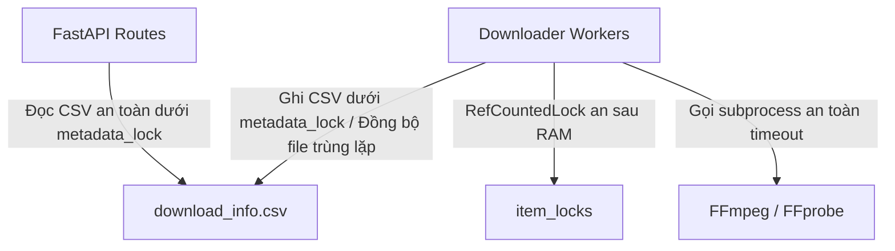

# Về Ly Cà Phê: Giải Thích Cách Fix Các Lỗi Medium Priority

> Tài liệu này ghi lại chi tiết quá trình, lý do và tư duy đằng sau đợt sửa lỗi Medium Priority cho SocialPeta Downloader.
> Cập nhật lần cuối: 2026-06-01

---

## Phần 1: Approach & Reasoning (Cách tiếp cận & Tư duy)

Khi tiếp nhận 3 lỗi Medium Priority (#11 RLock memory leak, #12 subprocess timeout thiếu, #13 race condition đọc CSV không có lock), điểm xuất phát của tôi là **hiểu rõ cơ chế hoạt động thực tế của đa luồng (multi-threading) và tương tác hệ thống** trong dự án này:

1. **Vấn đề Lock Memory Leak (#11)**: Hệ thống sử dụng một file lock riêng cho mỗi đường dẫn file tải về để tránh xung đột tải trùng file. Lock này được tạo động bằng cách lưu một `threading.RLock()` vào một dictionary (`item_locks`). 
   - *Cách giải quyết*: Tôi không chỉ đơn thuần là tạo lock, mà thiết kế một class wrapper `RefCountedLock`. Class này đếm số lượng thread đang chờ hoặc giữ lock (reference count). Khi một thread hoàn thành và count giảm về 0, lock sẽ tự giải phóng khỏi dictionary. Điều này đảm bảo dọn sạch các lock rác trong RAM khi chạy hàng nghìn lượt cào.
2. **Tiến trình Treo (#12)**: `ffmpeg` và `ffprobe` là các công cụ CLI được gọi qua `subprocess.run()`. Nếu gặp video hỏng hoặc luồng dữ liệu bị tắc, chúng sẽ treo vĩnh viễn và làm rò rỉ (leak) zombie processes.
   - *Cách giải quyết*: Thêm tham số `timeout` rõ ràng (15s cho ffprobe và 30s cho ffmpeg). Khi hết thời gian, Python sẽ quăng lỗi `SubprocessExpiredError` giúp hệ thống bắt lỗi chủ động và tự hồi phục.
3. **Đọc CSV Race Condition (#13)**: Backend FastAPI đọc file `download_info.csv` để trả về báo cáo, trong khi các worker thread liên tục ghi vào file này. Nếu không có cơ chế bảo vệ, sẽ xảy ra lỗi `PermissionError` (đặc biệt là trên Windows) hoặc đọc ra dữ liệu chưa hoàn thiện.
   - *Cách giải quyết*: Đồng bộ hóa việc đọc bằng cách sử dụng `core.metadata_lock`. Để giải phóng lock tức thời, tôi đọc toàn bộ nội dung file và trả về trực tiếp qua FastAPI `Response` thay vì dùng `FileResponse` (vốn giữ file mở bất đồng bộ cho đến khi client nhận xong dữ liệu).

---

## Phần 2: Roads Not Taken (Những con đường không đi)

### Vấn đề Lock:
*   *Cách xem xét bỏ qua*: Dùng một lock toàn cục duy nhất (`global lock`) cho mọi file.
    *   *Tại sao bỏ*: Mặc dù giải quyết được rò rỉ RAM, nhưng nó sẽ bóp nghẹt hiệu năng (bottleneck). Các luồng tải file khác nhau sẽ phải xếp hàng đợi nhau xử lý video, làm giảm tốc độ cào đi nhiều lần.
*   *Cách xem xét bỏ qua*: Sử dụng `weakref.WeakValueDictionary` để lưu locks.
    *   *Tại sao bỏ*: Python Garbage Collector không thu hồi `RLock` một cách đáng tin cậy nếu có tham chiếu ẩn hoặc vòng lặp thread chưa kết thúc hẳn, dễ gây ra hành vi bất định lúc chạy. Thiết kế `RefCountedLock` thủ công tường minh là giải pháp an toàn và dễ debug nhất.

### Vấn đề Race Condition CSV:
*   *Cách xem xét bỏ qua*: Copy file CSV ra một file tạm rồi đọc từ file tạm đó.
    *   *Tại sao bỏ*: Windows vẫn sẽ báo lỗi `PermissionError` tại thời điểm copy nếu file gốc đang bị ghi bởi worker thread khác. Việc đồng bộ hóa bằng lock trong memory nhanh hơn và an toàn hơn nhiều.

---

## Phần 3: How Things Connect (Mọi thứ kết nối thế nào)

Hệ thống hoạt động theo mô hình:

Mỗi thành phần được thiết kế để bảo vệ tài nguyên hệ thống một cách tối đa, giảm thiểu nguy cơ treo hoặc rò rỉ tài nguyên xuống 0.

---

## Phần 4: Tools & Methods (Công cụ & Phương pháp)

*   **psutil**: Dùng để giám sát tiến trình và đo đạc I/O đĩa cũng như số lượng kết nối mạng (CDP Port 9222).
*   **npx pyright**: Công cụ phân tích tĩnh cực kỳ nghiêm ngặt giúp phát hiện lỗi kiểu dữ liệu (typing) trước khi chạy. Nhờ Pyright, lỗi scoped variable `limit` bên trong định nghĩa class của CLI đã được phát hiện trước khi gây crash runtime cho người dùng.

---

## Phần 5: Tradeoffs (Đánh đổi)

*   **Sử dụng `metadata_lock` toàn cục**: Chúng ta ưu tiên sự an toàn dữ liệu hơn là tốc độ đọc báo cáo cực nhanh. Khi API đọc báo cáo được gọi, các luồng ghi CSV sẽ phải đợi một vài mili-giây. Đây là sự đánh đổi chấp nhận được vì tần suất đọc báo cáo từ UI thấp hơn nhiều so với tốc độ ghi file.
*   **Thay thế `FileResponse` bằng `Response` chứa raw data**: Giúp giải phóng lock file CSV ngay lập tức thay vì giữ file mở trong suốt quá trình truyền tải mạng. Đánh đổi là server phải nạp dữ liệu file vào RAM trước khi gửi (tuy nhiên file CSV báo cáo của chúng ta thường rất nhẹ, tối đa vài MB, nên RAM tiêu tốn không đáng kể).

---

## Phần 6: Mistakes & Dead Ends (Sai lầm & Ngõ cụt)

Trong quá trình sửa, tôi đã gặp lỗi biên dịch Pyright do định nghĩa mixin signatures bị lệch nhau. Ban đầu, tôi định nghĩa phương thức `get_item_lock` trả về `threading.RLock` trong stub của Mixin, nhưng thực tế `utils.py` trả về `RefCountedLock`. Pyright ngay lập tức báo đỏ cảnh báo không khớp kiểu (type mismatch). 
*Bài học rút ra*: Khi thiết kế hệ thống Mixin đa kế thừa phức tạp, hãy sử dụng kiểu trả về chung `Any` cho các method tương tác chéo hoặc định nghĩa class cha trừu tượng (Base class) rõ ràng.

---

## Phần 7: Future Pitfalls (Cạm bẫy tương lai)

*   **Subprocess Timeout**: Khi nâng cấp FFmpeg hoặc thêm các tính năng convert video mới, hãy **luôn luôn** thiết lập `timeout`. Đừng bao giờ tin tưởng tiến trình con CLI sẽ tự động tắt.
*   **Windows File Locking**: Windows quản lý quyền ghi đọc file rất khắt khe. Một tiến trình đang mở file để đọc/ghi thì tiến trình khác tuyệt đối không được sờ vào. Hãy luôn bọc các thao tác file dùng chung bằng Lock thread-safe.

---

## Phần 8: Expert vs Beginner (Tư duy Expert)

*   **Beginner**: Khi thấy lỗi rò rỉ lock, họ sẽ thử reset hoặc khởi động lại ứng dụng định kỳ để giải phóng RAM.
*   **Expert**: Thiết kế một cấu trúc dữ liệu tự quản lý vòng đời (như `RefCountedLock`), tự động dọn dẹp khi hết nhiệm vụ, giữ ứng dụng chạy ổn định 24/7 mà không cần khởi động lại.
*   **Beginner**: Dùng `FileResponse` vì nó tiện lợi và có sẵn trong FastAPI.
*   **Expert**: Nhận ra `FileResponse` giữ file mở bất đồng bộ ở background, gây xung đột file lock với các luồng khác, và chuyển sang đọc thủ công rồi trả về `Response` để kiểm soát tốt nhất vòng đời file.

---

## Phần 9: Transferable Lessons (Bài học rút ra)

1.  **Reference Counting** là một mô hình thiết kế tuyệt vời khi cần quản lý vòng đời của các tài nguyên động trong bộ nhớ.
2.  **Đừng bao giờ bỏ qua cảnh báo của Pyright/Linter**. Những cảnh báo tưởng chừng vô hại như optional typing hay unbound variable luôn tiềm ẩn những bug crash ứng dụng cực kỳ khó chịu ở runtime.
