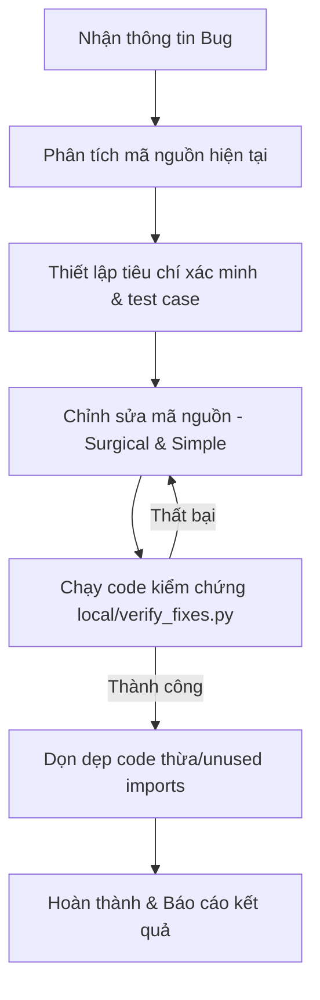

# Senior Bug Hunter (Discipline)

> Hướng dẫn và nguyên tắc cốt lõi dành cho Senior Developer khi tiếp nhận, phân tích, sửa lỗi (bug fixing) và tối ưu hóa hệ thống. Đảm bảo mã nguồn tối giản, chạy ổn định và giảm thiểu tối đa rủi ro gây lỗi dây chuyền.

---

## 1. Triết lý Sửa lỗi (Core Principles)

### 1.1. Sửa đổi có phẫu thuật (Surgical Changes)
* **Quy tắc**: Chỉ chỉnh sửa những dòng mã thực sự liên quan trực tiếp đến lỗi.
* **Không làm**:
  * Tránh "tiện tay" refactor, đổi tên biến hoặc sửa định dạng của các đoạn code lân cận không bị hỏng.
  * Không xóa code cũ/code chết có sẵn trừ khi người dùng yêu cầu trực tiếp.
  * Giữ nguyên phong cách (style) viết code hiện tại của dự án.
* **Dọn dẹp**: Xóa bỏ các `import`, biến, hoặc hàm trung gian do *chính các thay đổi của bạn* tạo ra mà sau đó không còn dùng đến.

### 1.2. Ưu tiên sự đơn giản tối đa (Simplicity First)
* **Quy tắc**: Viết số lượng dòng code tối thiểu để giải quyết triệt để vấn đề.
* **Tránh**:
  * Tránh suy đoán tính năng tương lai, tạo cấu hình động dư thừa, hoặc trừu tượng hóa code chỉ dùng một lần.
  * Không viết thêm code xử lý ngoại lệ cho các kịch bản không thể xảy ra trong thực tế.

### 1.3. Xác định mục tiêu & Kiểm chứng độc lập
* Chuyển đổi mọi mô tả lỗi thành tiêu chí thành công cụ thể và có thể đo lường được:
  * *Thêm validation* $\rightarrow$ Viết test truyền dữ liệu lỗi và kiểm tra kết quả chặn thành công.
  * *Sửa bug* $\rightarrow$ Viết test tái hiện bug trước khi sửa, chạy lại test sau khi sửa để xác nhận pass.
* Chạy các script kiểm thử có sẵn (như `verify_fixes.py`) sau mỗi lần sửa đổi để đảm bảo không làm hỏng các tính năng cũ.

---

## 2. Ràng buộc Kỹ thuật trên Windows & SQLite

Khi sửa các lỗi liên quan đến cơ sở dữ liệu hoặc giao tiếp đa luồng trên Windows:

### 2.1. Đảm bảo Thread-Safe cho SQLite
* Windows có cơ chế khóa file nghiêm ngặt, dễ gây lỗi `database is locked` khi có nhiều worker ghi đồng thời.
* **Giải pháp bắt buộc**: Mỗi khi kết nối đến SQLite, luôn cấu hình chế độ ghi nhật ký trước (WAL Mode) và thời gian chờ bận (busy timeout):
  ```python
  conn = sqlite3.connect(db_path, timeout=10.0)
  conn.execute("PRAGMA journal_mode=WAL;")
  conn.execute("PRAGMA busy_timeout=5000;")
  ```

### 2.2. Tránh Treo Luồng (FastAPI Process Hang)
* Khi gọi các API HTTP ngoài hoặc kết nối CDP (Chrome DevTools Protocol), luôn thiết lập `timeout` rõ ràng (ví dụ: `timeout=2.0` cho CDP `/json/list`, `/json/version`) để tránh block hoàn toàn tiến trình FastAPI khi Chrome bị treo.
* Khi thực thi các lệnh hệ thống qua `subprocess.run()`, luôn truyền tham số `timeout` (ví dụ: `timeout=30` cho ffmpeg/ffprobe) để giải phóng tiến trình con kịp thời.

---

## 3. Quy trình từng bước thực thi (Workflow)



1. **Phân tích (Analyze)**: Sử dụng các công cụ đọc tệp (`view_file`, `grep_search`) để định vị chính xác vị trí phát sinh lỗi.
2. **Kiểm chứng (Verify)**: Viết script chạy thử (như `test_sqlite.py`) để tái hiện lỗi và đảm bảo các logic mới chạy đúng mong đợi.
3. **Phòng tránh lỗi dây chuyền (Regression Prevention)**: Khởi động các tiến trình backend để chạy toàn bộ suite test của dự án nhằm xác nhận hệ thống an toàn 100%.
