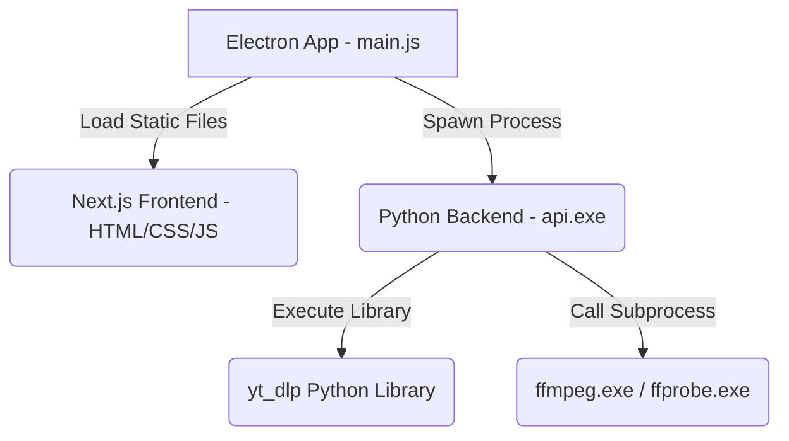

# Standalone Packaging

> Hướng dẫn đóng gói ứng dụng kết hợp giữa Next.js Frontend + Python FastAPI Backend + Electron + FFmpeg thành một bộ cài đặt (.exe) hoặc thư mục chạy độc lập (Portable) chạy trên mọi máy tính Windows mà không cần cài thêm bất kỳ dependency nào.

---

## 1. Cơ chế Đóng gói Độc lập (Architecture)

Ứng dụng chạy độc lập bằng cách tích hợp 3 lớp công nghệ vào một gói sản phẩm duy nhất thông qua Electron:



1. **Frontend (Next.js)**: Được xuất dưới dạng thư mục tĩnh (`out/`) bằng lệnh `npm run build`. Electron sẽ trực tiếp tải file `index.html` của Next.js mà không cần chạy server Node.js.
2. **Backend (FastAPI)**: Được PyInstaller biên dịch thành một file thực thi duy nhất (`api.exe`) đóng gói kèm theo Python runtime, FastAPI và toàn bộ thư viện cần thiết.
3. **Tài nguyên Nhị phân (FFmpeg & FFprobe)**: Được đặt trong thư mục `resources/` của Electron (được định nghĩa qua thuộc tính `extraResources` trong `package.json`).

---

## 2. Các Ràng buộc & Cấu hình Kỹ thuật Cốt lõi

Để đảm bảo bộ cài chạy được ở bất kỳ máy tính Windows nào của người dùng cuối:

### 2.1. Quyền ghi tệp tin (Write Permission & AppData)
* **Vấn đề**: Bản cài đặt NSIS cài mặc định vào `C:\Program Files\...`, nơi Windows cấm ghi file trừ khi chạy bằng quyền Administrator.
* **Cơ chế hoạt động**:
  * Electron truyền đường dẫn thư mục lưu trữ ứng dụng (`app.getPath('userData')`) sang Backend qua biến môi trường `USER_DATA_PATH`.
  * Backend tự nhận diện biến này và khởi tạo thư mục lưu trữ dữ liệu cào (`data/videos/` và `data/playwright_session/`) tại:
    `C:\Users\<Tên_User>\AppData\Roaming\my-tools-desktop\`
  * Điều này đảm bảo app luôn chạy mượt mà, không bao giờ bị lỗi crash phân quyền ghi.

### 2.2. Tự động định vị FFmpeg & FFprobe
* **Cơ chế hoạt động**: 
  * Khi chạy ở chế độ đóng gói (`sys.frozen == True`), backend tự động phân giải thư mục chạy thực tế (`sys.executable`) là thư mục `resources/` của Electron.
  * Cấu hình `Settings.FFMPEG_PATH` và `Settings.FFPROBE_PATH` trong `config.py` sẽ trả về đường dẫn trực tiếp đến file `ffmpeg.exe` / `ffprobe.exe` nằm cùng thư mục này.

### 2.3. Điều khiển Trình duyệt (Chrome CDP)
* **Cơ chế hoạt động**:
  * Dự án sử dụng Google Chrome có sẵn trên hệ thống của người dùng để tối ưu dung lượng gói cài đặt (~80MB thay vì ~300MB nếu đóng gói kèm Chromium).
  * `chrome.py` tự động quét registry của Windows (`winreg`) và các đường dẫn cài đặt mặc định để tìm `chrome.exe` và khởi động ở chế độ Debugging Port (`9222`).

---

## 3. Điều kiện của Máy Build (Trước khi Đóng gói)

Trước khi chạy lệnh đóng gói, bạn phải chuẩn bị đầy đủ các điều kiện sau:

1. **Cài đặt FFmpeg & FFprobe vào hệ thống**:
   * File `ffmpeg.exe` và `ffprobe.exe` phải tồn tại trong biến môi trường `PATH` của máy bạn.
   * *Kiểm tra*: Mở CMD/PowerShell gõ `ffmpeg -version` và `ffprobe -version` phải hiển thị thông tin phiên bản.
2. **Cài đặt thư viện Python đầy đủ**:
   * Chạy lệnh cập nhật trong `.venv` để nạp các package mới nhất (đặc biệt là `yt-dlp` bản thư viện):
     ```powershell
     .venv\Scripts\pip install -r requirements.txt
     ```
3. **Cài đặt thư viện Node.js cho Electron**:
   * Đi vào thư mục `electron/` và chạy `npm install`.

---

## 4. Các bước đóng gói chi tiết (Step-by-step)

Mở PowerShell tại thư mục gốc của dự án (`my_tools/`) và chạy script đóng gói tự động:

```powershell
.venv\Scripts\python scripts/build.py
```

### Quy trình tự động bên trong script `build.py`:
1. Build Frontend Next.js tạo thư mục tĩnh `out/`.
2. Biên dịch Backend Python thành `api.exe` với các `hidden-imports` (uvicorn, fastapi, yt_dlp...).
3. Sao chép `api.exe` và các tệp `ffmpeg.exe`, `ffprobe.exe` (từ PATH) vào thư mục `electron/resources/`.
4. Sao chép folder Next.js tĩnh vào `electron/frontend/`.
5. Thực thi `electron-builder` để đóng gói toàn bộ ứng dụng.

---

## 5. Đầu ra của Quá trình Build (Output Dist)

Sau khi hoàn thành, thư mục `electron/dist/` sẽ xuất hiện các phiên bản:

| Dạng đóng gói | Đường dẫn | Đặc điểm | Cách phân phối |
| :--- | :--- | :--- | :--- |
| **Portable (Không cài đặt)** | `electron/dist/win-unpacked/` | Là thư mục chứa các file ứng dụng được giải nén sẵn. | Nén zip toàn bộ thư mục `win-unpacked` gửi cho khách hàng. Chỉ cần mở `MyTools.exe` là chạy ngay. |
| **Installer (Bộ cài)** | `electron/dist/MyTools Setup 1.0.0.exe` | Là file cài đặt tự động (NSIS Setup). | Gửi duy nhất file `.exe` này cho khách hàng để cài đặt và tạo Shortcut ra màn hình Desktop. |

---

## 6. Lỗi thường gặp & Cách khắc phục (Troubleshooting)

### 6.1. Build thành công nhưng Installer mở lên bị đứng/không tải được dữ liệu
* **Nguyên nhân**: File `ffmpeg.exe` hoặc `ffprobe.exe` không tồn tại trong `PATH` của máy build lúc đóng gói, dẫn đến script build không copy được chúng vào thư mục `resources/` khiến `electron-builder` bị thiếu file.
* **Cách sửa**: Tải FFmpeg và cấu hình `PATH` trên máy build chính xác, sau đó chạy lại lệnh build.

### 6.2. Lỗi import thư viện Python khi chạy `api.exe` (Ví dụ: `ModuleNotFoundError: No module named '...'`)
* **Nguyên nhân**: Một số package được import động (như `uvicorn` backend, `yt_dlp` engine, v.v.) không được PyInstaller phát hiện tĩnh khi biên dịch.
* **Cách sửa**: Thêm tên module đó vào mảng `hidden_imports` trong `scripts/build.py`, sau đó rebuild lại.

### 6.3. Lỗi chiếm dụng cổng 8003 (`[WinError 10013]`)
* **Nguyên nhân**: File `api.exe` cũ đang chạy ngầm trên máy build hoặc dev server cũ chưa tắt.
* **Cách sửa**: Tắt ứng dụng đang mở, hoặc giải phóng cổng bằng lệnh:
  ```powershell
  Stop-Process -Id (Get-NetTCPConnection -LocalPort 8003).OwningProcess -Force
  ```
