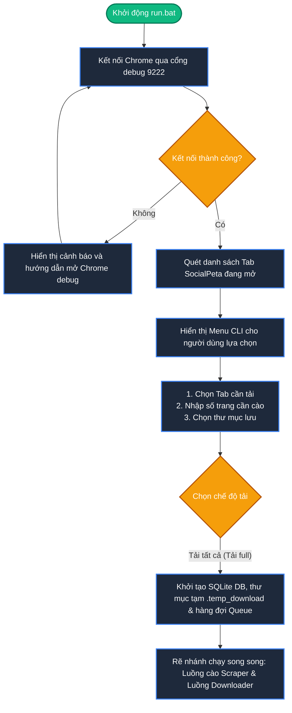
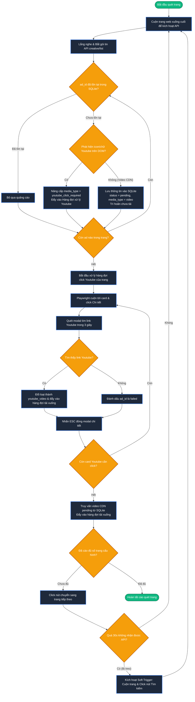
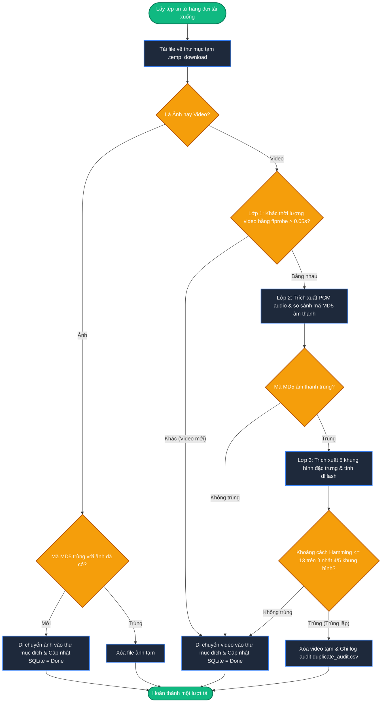

# Sơ đồ Hoạt động (Activity Diagram)

Tài liệu này đặc tả luồng hoạt động chi tiết (quy trình nghiệp vụ, các bước rẽ nhánh, xử lý song song và điều kiện quyết định) trong hệ thống **SocialPeta Downloader v2**.

Để xem sơ đồ dưới dạng hình vẽ trực quan, bạn hãy mở chế độ **Markdown Preview** trong trình soạn thảo (nhấn tổ hợp phím `Ctrl + Shift + V` hoặc click vào biểu tượng Preview ở góc trên cùng bên phải).

---

## 1. Hoạt động Khởi chạy & Cấu hình hệ thống (Khởi đầu)

Sơ đồ hoạt động mô tả quy trình người dùng khởi động ứng dụng và hệ thống thiết lập các tài nguyên ban đầu:

---

## 2. Hoạt động Cào quét, Phân trang & Trích xuất Youtube (Luồng Cào)

Mô tả hoạt động chi tiết của **Luồng Cào dữ liệu (Scraper Thread)** khi điều khiển trình duyệt và xử lý cào link Youtube:

---

## 3. Hoạt động Tải xuống & Lọc trùng lặp (Luồng Tải)

Mô tả các hoạt động của **Luồng tải xuống (Downloader Workers)** và quy trình kiểm duyệt lọc trùng lặp 3 lớp:

