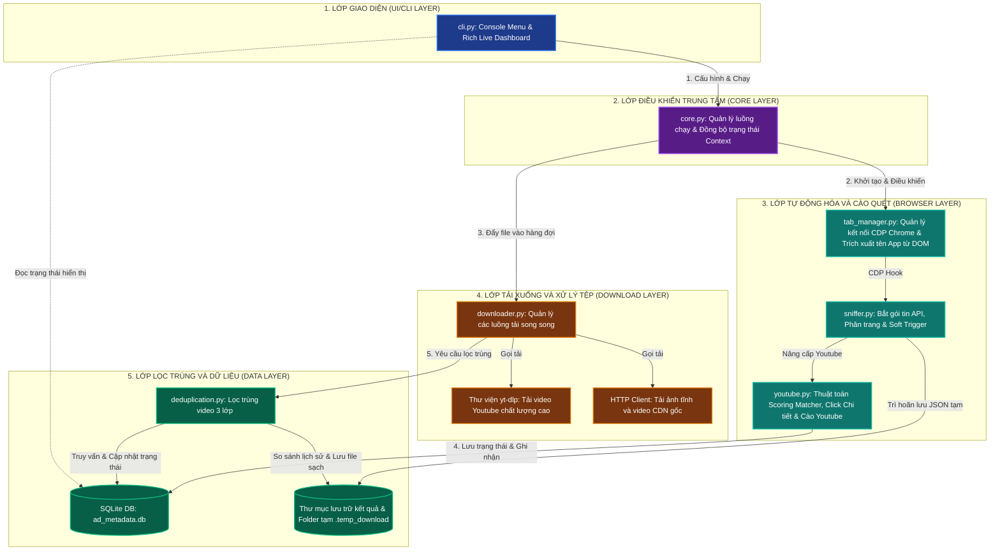

# Sơ đồ Kiến trúc Hệ thống (Architecture Diagram)

Tài liệu này mô tả kiến trúc phân lớp, các thành phần phần mềm và luồng trao đổi dữ liệu trong hệ thống **SocialPeta Downloader v2**.

Để xem sơ đồ dưới dạng hình vẽ trực quan, bạn hãy mở chế độ **Markdown Preview** trong trình soạn thảo (nhấn tổ hợp phím `Ctrl + Shift + V` hoặc click vào biểu tượng Preview ở góc trên cùng bên phải).

---

## 1. Sơ đồ Kiến trúc Phân lớp (Layered Architecture)

Dưới đây là sơ đồ kiến trúc thể hiện cách các thành phần trong code được chia lớp và giao tiếp với nhau:

---

## 2. Mô tả vai trò các thành phần chính

### 2.1. Lớp Giao diện (Presentation Layer)
* **`cli.py`**:
  - Cung cấp menu tương tác đầu vào để người dùng cấu hình tham số tải.
  - Sử dụng thư viện `rich` để dựng giao diện bảng biểu trực quan hiển thị trạng thái cào tải theo thời gian thực (Ads sniffed, Pending, Done, Duplicates, Speed).

### 2.2. Lớp Điều khiển (Core Layer)
* **`core.py`**:
  - Đóng vai trò là bộ não điều phối chính. Khởi tạo cơ sở dữ liệu SQLite, khởi chạy các luồng tải song song (`downloader_threads`), luồng lọc trùng video (`dedup_thread`), và bắt đầu luồng cào dữ liệu Playwright trên từng tab.
  - Quản lý cơ chế đồng bộ trạng thái luồng (`threading.Event`, `Queue`).

### 2.3. Lớp Tự động hóa và Cào quét (Browser Layer)
* **`tab_manager.py`**: Kết nối tới trình duyệt Chrome qua cổng debug bằng giao thức CDP (Chrome DevTools Protocol). Trích xuất tên game/ứng dụng để tự tạo thư mục lưu.
* **`sniffer.py`**: Lắng nghe sự kiện gói tin phản hồi mạng. Khi nhận thấy gói tin `/creative/list`, tiến hành phân tách tài nguyên. Điều khiển phân trang tự động và thực hiện cơ chế kích hoạt lại (Soft Trigger) khi trang web bị đứng.
* **`youtube.py`**: Chứa thuật toán khớp điểm (**Scoring Matcher**) để tìm đúng card quảng cáo YouTube cần click, ra lệnh cho trình duyệt click mở modal chi tiết, trích xuất link YouTube gốc và đóng modal.

### 2.4. Lớp Tải xuống song song (Download Layer)
* **`downloader.py`**: Lấy các tệp tin từ hàng đợi tải xuống (`pending_downloads`). Tự động nhận diện loại tệp tin để phân phối: gọi `yt-dlp` đối với link YouTube, hoặc gọi tải HTTP thông thường đối với ảnh và video gốc CDN. Lưu trữ tạm thời vào thư mục ẩn `.temp_download`.

### 2.5. Lớp Lọc trùng và Dữ liệu (Data Layer)
* **`deduplication.py`**: Đảm nhiệm vai trò lọc trùng lặp video bằng quy trình 3 lớp nghiêm ngặt (kiểm tra độ dài, mã MD5 âm thanh PCM trích xuất bằng `ffmpeg`, và khoảng cách Hamming `dHash` của các khung hình đặc trưng).
* **SQLite Database (`ad_metadata`)**: Lưu trữ và khóa trạng thái xử lý của từng quảng cáo theo `ad_id` để tránh việc xử lý hoặc click trùng lặp.
* **File Store**: Tổ chức thư mục lưu trữ đích sạch sẽ, tự động dọn dẹp thư mục tạm `.temp_download` khi hoàn tất.
