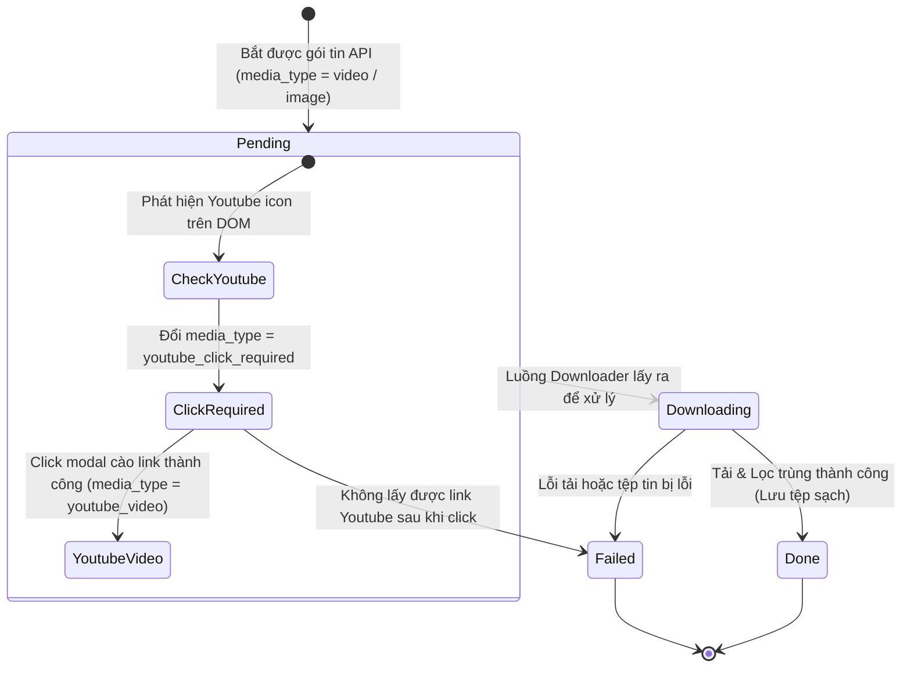

# Thiết kế Cơ sở dữ liệu (Database Design)

Tài liệu này đặc tả thiết kế cơ sở dữ liệu SQLite được sử dụng trong hệ thống **SocialPeta Downloader v2** để quản lý trạng thái tải xuống, đồng bộ luồng và chống trùng lặp.

---

## 1. Kiến trúc lưu trữ cơ sở dữ liệu

* **Hệ quản trị cơ sở dữ liệu**: SQLite (sử dụng thư viện mặc định `sqlite3` của Python).
* **Tên tệp tin**: Mặc định lưu trữ tại thư mục chạy dự án dưới dạng tệp cơ sở dữ liệu cục bộ: `ad_metadata.db` (được tạo tự động khi khởi động CLI).
* **Mục đích**: Lưu trữ trạng thái xử lý của từng quảng cáo theo mã `ad_id` duy nhất, cho phép tiếp tục phiên tải khi bị gián đoạn và ngăn chặn việc click cào trùng lặp.

---

## 2. Đặc tả Chi tiết bảng `ad_metadata`

Đây là bảng lưu trữ thông tin duy nhất và cốt lõi của ứng dụng:

### 2.1. Cấu trúc bảng (Schema)

```sql
CREATE TABLE IF NOT EXISTS ad_metadata (
    ad_id TEXT PRIMARY KEY,
    media_type TEXT,
    status TEXT,
    fpath TEXT,
    item_json TEXT,
    youtube_url TEXT,
    created_at DATETIME DEFAULT CURRENT_TIMESTAMP,
    updated_at DATETIME DEFAULT CURRENT_TIMESTAMP
);
```

### 2.2. Đặc tả các trường dữ liệu (Fields Specification)

| Tên trường | Kiểu dữ liệu | Ràng buộc | Mô tả chức năng |
| :--- | :--- | :--- | :--- |
| **`ad_id`** | TEXT | PRIMARY KEY | ID định danh duy nhất của quảng cáo (lấy từ dữ liệu API phản hồi). |
| **`media_type`** | TEXT | NOT NULL | Loại tài nguyên: `image` (ảnh), `video` (video CDN gốc), `youtube_click_required` (chờ click Youtube), hoặc `youtube_video` (đã lấy được link Youtube chuẩn). |
| **`status`** | TEXT | NOT NULL | Trạng thái xử lý: `pending` (chờ tải), `downloading` (đang tải), `done` (tải & lọc trùng xong), hoặc `failed` (lỗi cào/lỗi tải). |
| **`fpath`** | TEXT | NULL | Đường dẫn vật lý đến tệp tin lưu trữ sạch trên ổ đĩa sau khi hoàn thành. |
| **`item_json`** | TEXT | NULL | Toàn bộ dữ liệu thô dạng JSON của quảng cáo, dùng để khôi phục hoặc phân tích bổ sung. |
| **`youtube_url`** | TEXT | NULL | Liên kết video YouTube gốc cào được từ modal chi tiết. |
| **`created_at`** | DATETIME | DEFAULT current | Thời điểm tạo bản ghi quảng cáo lần đầu. |
| **`updated_at`** | DATETIME | DEFAULT current | Thời điểm cập nhật trạng thái quảng cáo lần cuối. |

---

## 3. Luồng trạng thái của bản ghi (State Transition)

Vòng đời trạng thái của quảng cáo được kiểm soát chặt chẽ qua trường `status` và `media_type`:



---

## 4. Cơ chế khóa đồng bộ luồng (Concurrency Control)

Vì hệ thống chạy mô hình đa luồng (Scraper thread ghi nhận API và điều khiển click trình duyệt, Downloader threads ghi nhận tải tệp tin và cập nhật trạng thái), SQLite có thể gặp lỗi `database is locked` nếu có hai luồng cùng ghi một lúc.

Để khắc phục điều này:
1. **Khóa đồng bộ (`history_lock`)**: Code triển khai một khóa đồng bộ luồng bằng `threading.Lock()` trong lớp Context:
   ```python
   with self.context.history_lock:
       # Thực hiện truy vấn SELECT / INSERT / UPDATE vào database
   ```
2. **Quản lý kết nối**: Mỗi luồng tự mở một kết nối SQLite riêng thông qua hàm `sqlite3.connect()`, tuyệt đối không dùng chung một biến kết nối `conn` giữa các luồng khác nhau.
3. **Commit tức thời**: Thực hiện `conn.commit()` ngay lập tức sau mỗi câu lệnh ghi (INSERT/UPDATE) để giải phóng khóa ghi trên database nhanh nhất có thể.
