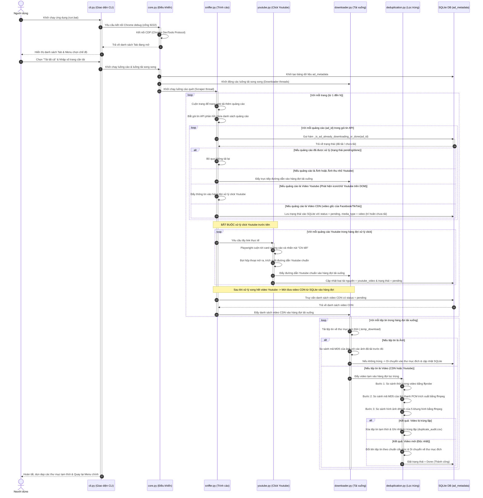

# Sơ đồ Tuần tự (Sequence Diagram)

Tài liệu này mô tả chi tiết trình tự tương tác theo dòng thời gian giữa các thành phần trong hệ thống **SocialPeta Downloader v2** khi thực hiện chế độ "Tải tất cả" (Tải full).

Để xem sơ đồ dưới dạng hình vẽ trực quan, bạn hãy mở chế độ **Markdown Preview** trong trình soạn thảo (nhấn tổ hợp phím `Ctrl + Shift + V` hoặc click vào biểu tượng Preview ở góc trên cùng bên phải).

---

## 1. Sơ đồ Tuần tự Chi tiết (Sequence Diagram)

Sơ đồ dưới đây thể hiện sự tương tác giữa: **Người dùng**, **giao diện CLI**, **Bộ điều khiển trung tâm (Core)**, **Trình cào (Scanner/Playwright)**, **Bộ click Youtube (YT)**, **Luồng tải (Downloader)**, **Bộ lọc trùng (Deduplicator)** và **Cơ sở dữ liệu (SQLite DB)**.

---

## 2. Các điểm cốt lõi trong dòng tuần tự

### 2.1. Chống click trùng lặp YouTube
* Ở bước số **12** (`_is_ad_already_downloading_or_done`), hệ thống kiểm tra ngay trong cơ sở dữ liệu SQLite để xem ID quảng cáo đã từng được tải hoặc đang xử lý click chưa. Nếu rồi thì bỏ qua ngay.
* Ở bước số **23** (`Cập nhật loại tài nguyên = youtube_video`), sau khi lấy được liên kết YouTube thực tế, hệ thống cập nhật lại loại tài nguyên trong DB. Điều này giúp ngăn chặn trình duyệt click lại lần 2 vào quảng cáo này trong các lượt cuộn trang tiếp theo.

### 2.2. Nhận diện chính xác card YouTube (Tránh click nhầm Admob/các mạng khác)
* Ở bước số **21** (`Playwright cuộn tới card và nhấn nút "Chi tiết"`), thuật toán chấm điểm (Scoring Matcher) trong `youtube.py` lọc cứng và chỉ chấm điểm những card quảng cáo chứa icon của nền tảng YouTube (`.net-icon-youtube` hoặc tương đương). Nếu card không chứa icon YouTube, nó sẽ bị loại bỏ khỏi danh sách ứng viên click, ngăn chặn việc click nhầm vào các card quảng cáo của Admob, Facebook, TikTok... dù có trùng lặp hình ảnh/video hash hoặc App Name.

### 2.3. Trì hoãn tải Video CDN gốc
* Do video CDN của SocialPeta thường dễ tải hơn và không cần tương tác nhấp chuột, hệ thống trì hoãn việc tải chúng bằng cách lưu thông tin trực tiếp vào cơ sở dữ liệu SQLite dưới trạng thái chờ (`pending`).
* Hệ thống chỉ truy vấn các bản ghi video CDN này từ SQLite để đưa vào hàng đợi tải xuống sau khi đã hoàn thành click mở modal để cào hết tất cả các đường dẫn video YouTube trên trang hiện tại. Điều này tối ưu hóa việc phân phối tài nguyên hệ thống, tránh sử dụng các file JSON tạm thời làm mất đồng bộ dữ liệu và không làm nghẽn luồng xử lý của trình duyệt Playwright.
