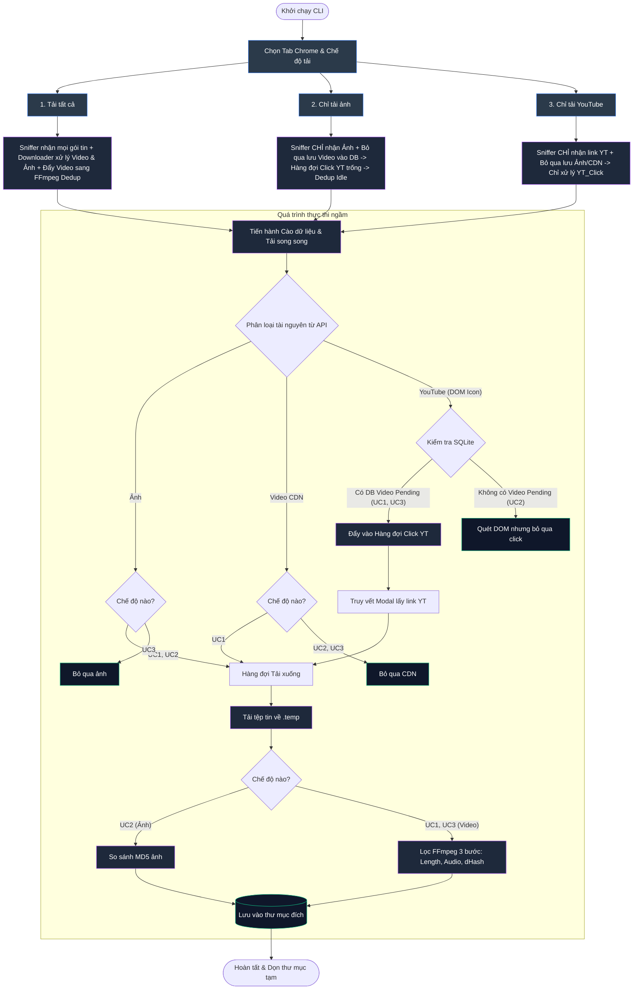
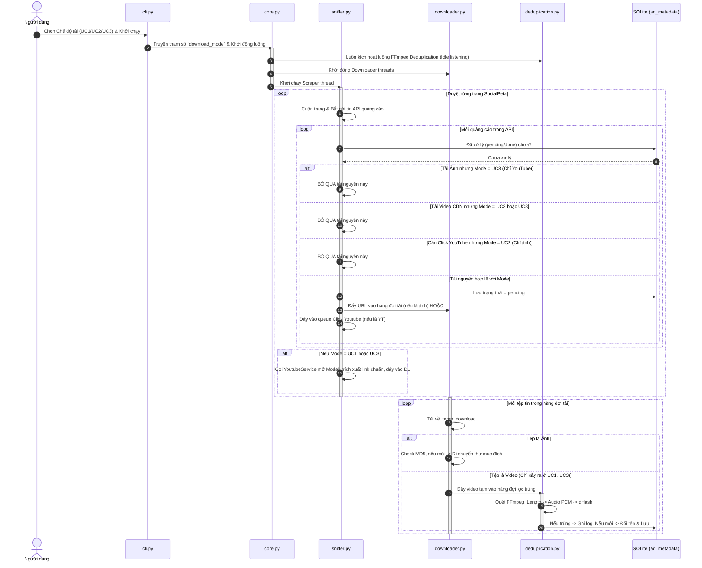

# Sơ đồ Luồng và Trình tự (Workflows & Diagrams)

Tài liệu này mô tả chi tiết các sơ đồ hoạt động, luồng xử lý và cách hệ thống rẽ nhánh khi người dùng thay đổi chế độ tải (Đặc tả cách xử lý riêng cho 3 Use Case: Tải tất cả, Chỉ tải ảnh, Chỉ tải YouTube).

---

## 1. Lưu đồ Hoạt động (Flowchart)

Lưu đồ thể hiện cách hệ thống rẽ nhánh logic và tối ưu luồng dựa trên lựa chọn của người dùng, đặc biệt ở khâu Cào Dữ Liệu và Lọc Trùng.

---

## 2. Sơ đồ Tuần tự (Sequence Diagram)

Sơ đồ trình tự mô tả cách hệ thống áp dụng bộ lọc chế độ tải `download_mode` để phân phối tải và bật/tắt các luồng (Downloader/Dedup) một cách linh hoạt.

