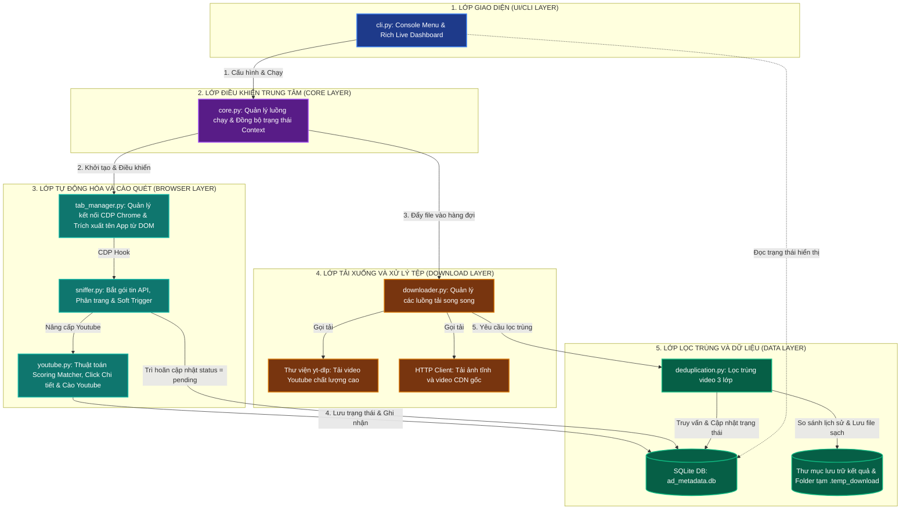

# Sơ đồ Kiến trúc Hệ thống (Architecture Diagram)

Tài liệu này mô tả kiến trúc phân lớp, các thành phần phần mềm và luồng trao đổi dữ liệu trong hệ thống **SocialPeta Downloader v2**.

Để xem sơ đồ dưới dạng hình vẽ trực quan, bạn hãy mở chế độ **Markdown Preview** trong trình soạn thảo (nhấn tổ hợp phím `Ctrl + Shift + V` hoặc click vào biểu tượng Preview ở góc trên cùng bên phải).

---

## 1. Sơ đồ Kiến trúc Phân lớp (Layered Architecture)

Dưới đây là sơ đồ kiến trúc thể hiện cách các thành phần trong code được chia lớp và giao tiếp với nhau:



---

## 2. Mô tả vai trò các thành phần chính

### 2.1. Lớp Giao diện (Presentation Layer)
* **`cli.py`**:
  - Cung cấp menu tương tác đầu vào để người dùng cấu hình tham số tải.
  - Sử dụng thư viện `rich` để dựng giao diện bảng biểu trực quan hiển thị trạng thái cào tải theo thời gian thực (Ads sniffed, Pending, Done, Duplicates, Speed).

### 2.2. Lớp Điều khiển (Core Layer)
* **`core.py`**:
  - Đóng vai trò là bộ não điều phối chính. Khởi tạo cơ sở dữ liệu SQLite, khởi chạy các luồng tải song song (`downloader_threads`), luồng lọc trùng video (`dedup_thread`), và bắt đầu luồng cào dữ liệu Playwright trên từng tab.
  - Quản lý cơ chế đồng bộ trạng thái luồng (`threading.Event`, `Queue`).

### 2.3. Lớp Tự động hóa và Cào quét (Browser Layer)
* **`tab_manager.py`**: Kết nối tới trình duyệt Chrome qua cổng debug bằng giao thức CDP (Chrome DevTools Protocol). Trích xuất tên game/ứng dụng để tự tạo thư mục lưu.
* **`sniffer.py`**: Lắng nghe sự kiện gói tin phản hồi mạng. Khi nhận thấy gói tin `/creative/list`, tiến hành phân tách tài nguyên. Điều khiển phân trang tự động và thực hiện cơ chế kích hoạt lại (Soft Trigger) khi trang web bị đứng.
* **`youtube.py`**: Chứa thuật toán khớp điểm (**Scoring Matcher**) để tìm đúng card quảng cáo YouTube cần click (bắt buộc kiểm tra sự hiện diện của icon YouTube nhằm tránh click nhầm sang các nền tảng khác như Admob), ra lệnh cho trình duyệt click mở modal chi tiết, trích xuất link YouTube gốc và đóng modal.

### 2.4. Lớp Tải xuống song song (Download Layer)
* **`downloader.py`**: Lấy các tệp tin từ hàng đợi tải xuống (`pending_downloads`). Tự động nhận diện loại tệp tin để phân phối: gọi `yt-dlp` đối với link YouTube, hoặc gọi tải HTTP thông thường đối với ảnh và video gốc CDN. Lưu trữ tạm thời vào thư mục ẩn `.temp_download`.

### 2.5. Lớp Lọc trùng và Dữ liệu (Data Layer)
* **`deduplication.py`**: Đảm nhiệm vai trò lọc trùng lặp video bằng quy trình 3 lớp nghiêm ngặt (kiểm tra độ dài, mã MD5 âm thanh PCM trích xuất bằng `ffmpeg`, và khoảng cách Hamming `dHash` của các khung hình đặc trưng).
* **SQLite Database (`ad_metadata`)**: Lưu trữ và khóa trạng thái xử lý của từng quảng cáo theo `ad_id` để tránh việc xử lý hoặc click trùng lặp.
* **File Store**: Tổ chức thư mục lưu trữ đích sạch sẽ, tự động dọn dẹp thư mục tạm `.temp_download` khi hoàn tất.


# CLI V2 - Kiến trúc & Nguyên lý hoạt động

Tài liệu này giải thích chi tiết về nguyên lý hoạt động của SocialPeta Downloader CLI V2, bao gồm vòng đời của một phiên làm việc (Session) và cơ chế trích xuất link YouTube tự động không bỏ sót.

---

## 1. Vòng đời của một phiên làm việc (Session Lifecycle)

CLI V2 hoạt động theo cơ chế **In-memory Configuration** (Cấu hình trên RAM) và tương tác bằng phím mũi tên. Mọi thay đổi về cấu hình chỉ tồn tại trong suốt quá trình chạy của phiên hiện tại và không ghi đè vào các file cấu hình vật lý.

### Quy trình hoạt động của CLI:

1. **Khởi chạy và kết nối Chrome Debug Port**:
   - Khi CLI được khởi chạy, nó nạp cấu hình mặc định:
     - Thư mục tải xuống: Tự động định vị thư mục `Downloads` chuẩn của người dùng trên Windows (ví dụ: `C:\Users\<Tên_User>\Downloads\SocialPeta_Downloader`) để tránh lỗi thiếu ổ đĩa (như ổ `D:\`).
     - Cổng gỡ lỗi Chrome (Chrome Debug Port): `9222`
     - Số luồng tải video song song: `3`
   - Gọi lớp `ChromeService` để kiểm tra xem cổng `9222` đã mở chưa.
   - Nếu cổng chưa mở, hệ thống tìm kiếm trình duyệt Google Chrome trên máy (Registry Windows hoặc các đường dẫn chuẩn) và tự động khởi chạy Chrome với tham số `--remote-debugging-port=9222` và thư mục profile riêng `chrome_debug_profile`.

2. **Xử lý sự cố kết nối Chrome (Chrome Trouble-shooting)**:
   - Nếu sau 5 giây không thể kết nối tới Chrome, chương trình không bị crash mà sẽ hiển thị menu xử lý sự cố gồm 3 tùy chọn:
     1. *Chọn khởi động lại trình duyệt với port đó*: Cố gắng tắt và khởi chạy lại Chrome trên cổng tương ứng.
     2. *Thử kết nối lại*: Kiểm tra lại trạng thái cổng một lần nữa (dành cho trường hợp người dùng mở Chrome thủ công chậm).
     3. *Đóng chương trình*: Thoát an toàn.

3. **Chọn trang tải (Tab Selection)**:
   - Hệ thống quét danh sách các tab đang mở trong Chrome qua CDP (Chrome DevTools Protocol) HTTP endpoint (`http://127.0.0.1:9222/json/list`).
   - Lọc ra các tab có URL khớp với SocialPeta hoặc Guangdada.
   - Hiển thị danh sách tiêu đề các tab lên CLI để người dùng di chuyển phím mũi tên LÊN/XUỐNG và nhấn `Enter` để chọn.

4. **Cấu hình phiên cào/tải**:
   - Người dùng chọn chế độ lọc tải:
     1. *Tải tất cả các loại*: Tải cả ảnh, video CDN, và video YouTube.
     2. *Chỉ tải ảnh*: Bỏ qua các tác vụ video, chỉ tải ảnh/thumbnail quảng cáo.
     3. *Chỉ tải video youtube*: Chỉ tải các quảng cáo chạy nguồn YouTube.
   - Chọn thư mục lưu: Chương trình mở hộp thoại hệ thống **Folder Explorer** (`tkinter.filedialog.askdirectory`) để người dùng dễ dàng chọn thư mục lưu (giá trị này ghi đè in-memory vào `context.download_dir`).
   - Nhập số lượng trang cần cào.

5. **Khởi chạy luồng song song (3-Stream parallel execution)**:
   - Sau khi bắt đầu chạy, CLI gọi `start_system` của Core Downloader để kích hoạt 3 luồng hoạt động độc lập:
     - **Stream 1 (Scraper/Sniffer - Luồng Cào/Phát hiện)**: Tự động cuộn trang, chuyển trang và click nút chuyển trang trên Chrome qua Playwright CDP. Luồng này bắt gói tin API trả về từ SocialPeta chứa metadata quảng cáo.
     - **Stream 2 (Downloader - Luồng Tải)**: Chạy nhiều worker song song (mặc định 3 luồng). Nó lấy các ad từ hàng đợi `pending_downloads` để tải ảnh/video CDN hoặc tải video YouTube qua `yt-dlp`.
     - **Stream 3 (Deduplication - Luồng Lọc trùng)**: Lắng nghe hàng đợi `filter_queue` của các video đã tải về dạng tạm thời. Sử dụng `ffmpeg` & `ffprobe` băm MD5 và so sánh vân tay video (phát hiện trùng lặp nâng cao). Nếu không trùng, đổi tên sang file unique lưu vào thư mục đích.
   - CLI hiển thị **Live Dashboard** cập nhật liên tục tiến độ: Số lượng đã sniff, đang tải, thành công, thất bại, trùng lặp và tiến trình tải của các luồng.

   > [!IMPORTANT]
   > **Điểm lưu ý quan trọng về cơ chế Phân trang & Sniffing Trang 1 (Thiết kế đồng bộ V1 & V2):**
   > - **Thiết kế chuẩn (Giống CLI V1)**: Khi người dùng yêu cầu tải Trang 1:
   >   - Nếu trình duyệt đang đứng sẵn ở Trang 1, hệ thống phải tự động click sang Trang 2 rồi quay ngược lại Trang 1 (`click_sequence = [2, 1]`) để kích hoạt trình duyệt tải lại dữ liệu từ API, giúp Sniffer bắt được gói tin chứa metadata quảng cáo.
   >   - Nếu trình duyệt đang ở Trang 2, hệ thống sẽ click chuyển về Trang 1 (`click_sequence = [1]`).
   > - **Điểm sai lệch trong code `sniffer.py` hiện tại**: Code hiện tại của V2 đang sử dụng hàm `soft_trigger` (cuộn trang và click Search) khi `active_page_num == 1` thay vì thực hiện cơ chế chuyển trang `[2, 1]` như thiết kế của V1. Điều này làm giảm tỷ lệ bắt gói tin thành công và cần được sửa lại về đúng cơ chế chuyển trang của V1.
   >
   > **Lưu ý thảo luận về trường hợp cào 2 trang (N = 2) và tính cồng kềnh:**
   > - *Ý kiến tối giản*: Sao không click sang Trang 2 lấy thông tin rồi quay về Trang 1 lấy thông tin cho mọi trường hợp?
   > - *Thực tế kỹ thuật*: Nếu trình duyệt đang ở Trang 2 sẵn, click thẳng vào nút Trang 2 sẽ không kích hoạt tải lại API (do SPA của SocialPeta không load lại nếu trang hiện tại trùng với nút bấm). Vì vậy:
   >   - Nếu đang ở Trang 1: Sequence là `[2, 1]` (Click 2 để lấy Trang 2, rồi về 1 để lấy Trang 1).
   >   - Nếu đang ở Trang 2: Sequence bắt buộc phải là `[1, 2]` (Phải click về Trang 1 để lấy Trang 1 trước, sau đó click ngược lại Trang 2 để lấy Trang 2).
   >   Việc sinh `click_sequence` động dựa trên trang hiện tại là bắt buộc để tránh trình duyệt không phản hồi khi click vào trang đang đứng.
   >
   > **Trường hợp cào nhiều trang (N > 2):**
   > Để tối ưu hóa và đảm bảo thu thập đầy đủ gói tin cho tất cả các trang được yêu cầu từ 1 đến N:
   > - **Nếu trình duyệt đang ở Trang 1**: Hành trình sẽ là `list(range(2, N + 1)) + [1]` (Ví dụ N=5: `[2, 3, 4, 5, 1]`). Hệ thống cào các trang từ 2 đến N trước, sau đó quay lại Trang 1 để cào Trang 1 cuối cùng.
   > - **Nếu trình duyệt đang ở Trang khác 1** (Ví dụ ở Trang 3): Hành trình sẽ là `list(range(1, N + 1))` (Ví dụ N=5: `[1, 2, 3, 4, 5]`). Hệ thống click về Trang 1 trước (để lấy Trang 1), sau đó lần lượt click tăng dần từ 2 đến N để lấy các trang còn lại.
   > Cơ chế này đảm bảo mọi bước chuyển trang đều là một cú click thay đổi trang thực sự, kích hoạt API gửi gói tin mới mà không bị trùng lặp trang hiện tại.

6. **Phím tắt thoát an toàn (Safe Exit Key)**:
   - Khi Dashboard đang chạy, người dùng có thể nhấn tổ hợp phím **`Ctrl + Q`** bất kỳ lúc nào để kích hoạt dừng khẩn cấp. Chương trình sẽ dừng mọi luồng cào/tải, dọn dẹp thư mục tạm `.tmp` và đưa người dùng trở lại Menu chính.

---

## 2. Cơ chế lấy hết link YouTube không bỏ sót

Đối với các quảng cáo SocialPeta chạy nguồn YouTube (thường có duration là `0s` hoặc không chứa link video CDN trực tiếp trong payload phản hồi API), CLI V2 áp dụng cơ chế Click chi tiết và Truy tìm link nhúng tự động như sau:

### Quy trình trích xuất chi tiết:

1. **Phân loại trạng thái ban đầu (`youtube_click_required`)**:
   - Khi gói tin API từ SocialPeta được sniff, lớp `UtilsService` phân tích metadata của ad.
   - Nếu phát hiện quảng cáo này chạy trên nền tảng YouTube (`platform == "youtube"` hoặc chứa từ khóa youtube trong trường publisher/youtube_url) nhưng **chưa có link YouTube trực tiếp** trong phản hồi API (thường là link CDN trống hoặc video 0s), ad này được gán `media_type = "youtube_click_required"`.
2. **Nâng cấp tự động qua DOM Scanner (`_upgrade_youtube_items_via_dom`)**:
   - Để tránh việc bỏ sót các quảng cáo bị gán nhầm là `video` CDN trong gói tin API nhưng thực tế có icon YouTube dưới góc card, trước khi xử lý hàng đợi click YouTube cho mỗi tab, hệ thống tự động quét DOM hiện tại.
   - Tìm kiếm các thẻ card chứa icon YouTube (`.net-icon-youtube` hoặc tương đương). Nếu phát hiện card có icon YouTube nhưng metadata tương ứng đang ở trạng thái `pending` của loại `video`, hệ thống tự động nâng cấp ad đó lên loại `youtube_click_required` và đẩy vào hàng đợi của tab để click trích xuất.
3. **Hàng đợi xử lý YouTube của từng Tab (`tab_youtube_queues`)**:
   - Sniffer đẩy các ad cần click YouTube vào hàng đợi của tab tương ứng `self.context.tab_youtube_queues[tab_index]`.
   - Ngay sau khi Sniffer hoàn thành việc cuộn và quét giao diện trên trang hiện tại, nó sẽ kiểm tra hàng đợi này. Nếu phát hiện có ad cần click YouTube, nó sẽ kích hoạt luồng trích xuất.
4. **Mô phỏng click chi tiết bằng Scoring Matcher**:
   - `YoutubeService` sử dụng thuật toán tính điểm tích lũy **Scoring Matcher** để tìm đúng card quảng cáo cần click, thay vì chỉ so khớp mã hash cover/thumbnail thuần túy dễ bị trượt.
   - Điểm số của mỗi card được tính như sau:
     - *So khớp Hash (20 điểm)*: Trùng hash ảnh/video CDN.
     - *So khớp App Name (5 điểm)*: Trùng khớp tên App (toàn bộ hoặc trùng khớp lũy tiến các từ khóa riêng lẻ).
     - *So khớp Content (10 điểm)*: Trùng Title/Body (toàn bộ hoặc chuỗi con tối thiểu 15 ký tự).
     - *Chỉ báo YouTube Icon (3 điểm)*: Thẻ card chứa class `.net-icon-youtube` hoặc tương đương.
   - Card đạt điểm cao nhất và tối thiểu là 5 điểm sẽ được cuộn tới (`scrollIntoView`) và kích hoạt click vào nút Chi tiết hoặc click trực tiếp lên card để mở modal chi tiết của ad đó.
5. **Mở modal chi tiết và truy vết (UC-03 click flow)**:
   - Khi modal chi tiết mở ra, hệ thống liên tục poll (quét định kỳ mỗi 500ms, tối đa 3-6 giây) để tìm:
     - Thẻ neo `a` trỏ đến `youtube.com` hoặc `youtu.be` trong modal.
     - Thẻ `iframe` nhúng trình phát video YouTube để lấy thuộc tính `src`.
     - Regex tìm link YouTube thô trong text modal.
6. **Chuẩn hóa và Tải về**:
   - Khi lấy được link YouTube, link sẽ được chuẩn hóa về dạng chuẩn `https://www.youtube.com/watch?v=VIDEO_ID`.
   - Trạng thái ad được cập nhật thành `youtube_video`, và ad được đẩy sang hàng đợi `pending_downloads` để luồng Downloader gọi `yt-dlp` tải xuống video chất lượng cao.
   - Sau khi hoàn thành hoặc thất bại, hệ thống gửi phím nóng `Escape` để đóng modal chi tiết và tiếp tục xử lý ad tiếp theo trong hàng đợi.

---

## 3. Bản đồ cấu trúc thư mục CLI V2

```text
tools/socialpeta_downloader/cli/cli_v2/
├── architecture.md       # Tài liệu kiến trúc và luồng chạy (File này)
├── cli.py                # Điểm chạy giao diện dòng lệnh V2 chính
└── run.bat               # File script Windows để khởi chạy nhanh CLI V2
```
