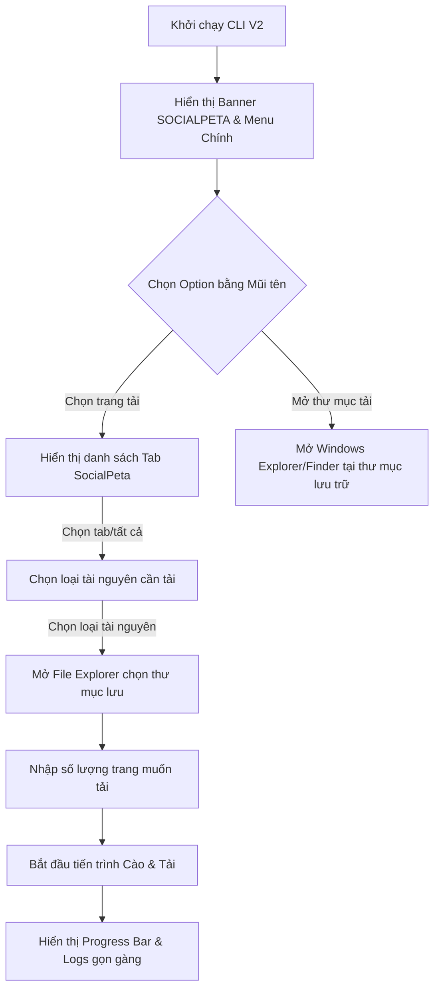

# SocialPeta Downloader - CLI V2 Specification & Design

Tài liệu này đặc tả các Use Cases (UC), thiết kế giao diện Terminal phong cách **Claude Code**, luồng tương tác sử dụng phím mũi tên, và hiển thị tiến trình tải tối ưu cho phiên bản **CLI V2** của công cụ **SocialPeta Downloader**.

---

## 1. Use Cases & Luồng Hoạt Động (Workflow)



### Bước 1: Khởi chạy và Menu Chính
- CLI hiển thị Banner chữ nghệ thuật (ASCII Art) cỡ lớn: **SOCIALPETA** màu xanh dương đậm (Cyan/Blue).
- **Khởi động Chrome Debug Port**: Ngay khi khởi chạy ứng dụng, CLI tự động kích hoạt trình duyệt Chrome thông qua thư viện `ChromeService` ở cổng gán trong bộ nhớ (mặc định là `9222`).
- **Xử lý lỗi kết nối Chrome**: Nếu không kết nối được (ví dụ do cổng bị chiếm dụng, Chrome bị treo hoặc người dùng lỡ tay đóng trình duyệt), giao diện hiển thị bảng thông báo lỗi và menu con để lựa chọn:
  ```
  [LỖI] Không thể kết nối tới Chrome tại cổng 9222.
  ? Hãy chọn hành động xử lý:
  ❯ 1. Chọn khởi động lại trình duyệt với port đó (Gọi lại ensure_chrome_debug_port)
    2. Thử kết nối lại
    3. Đóng chương trình
  ```
- Sau khi kết nối thành công, hiển thị menu điều hướng bằng phím mũi tên (Arrow keys) LÊN/XUỐNG và nhấn **Enter** để chọn.
- Các tùy chọn chính gồm:
  1. **Chọn trang tải**: Vào luồng quét tab và chuẩn bị tải video.
  2. **Mở thư mục tải**: Tự động mở cửa sổ File Explorer/Finder của hệ điều hành tại đường dẫn thư mục lưu trữ video đang được cấu hình.
  3. **Cài đặt hệ thống**: Cho phép cấu hình số luồng tải và thư mục tải mặc định.
  4. **Thoát chương trình**: Thoát an toàn.

### Bước 2: Chọn trang tải (Sub-menu)
Khi chọn **"Chọn trang tải"**, hệ thống quét các tab Chrome và hiển thị danh sách dạng menu con:
- `R. Load lại` (Quét lại danh sách tab từ trình duyệt Chrome)
- `1. Tải trang đang trỏ vào` (Tab Chrome mà người dùng đang mở/active trên màn hình)
- `2. Tải tất cả các trang SocialPeta đang mở`
- `3. Tải trang #1` (Tiêu đề ứng dụng ở tab SocialPeta thứ nhất)
- `4. Tải trang #2` (Tiêu đề ứng dụng ở tab SocialPeta thứ hai)
- `...` (Danh sách các tab SocialPeta khác)
- `Quay lại` (Trở về menu chính)

### Bước 3: Chọn loại tài nguyên cần tải (Sub-menu)
Ngay khi người dùng chọn xong trang cần tải, màn hình sẽ hiển thị menu con để chọn loại tài nguyên muốn tải về:
1. **Tải tất cả các loại**: Tải hết video (nếu video 0s nhưng bên trong chứa link YouTube thì phải truy tìm bằng được link YouTube đó để tải xuống, không bỏ sót), đồng thời tải toàn bộ ảnh của ad.
2. **Chỉ tải ảnh**: Chỉ tải về ảnh quảng cáo.
3. **Chỉ tải video youtube**: Chỉ tải về các video từ YouTube.
4. **Quay lại**: Trở lại màn hình Chọn trang tải.

### Bước 4: Chọn thư mục lưu (Folder Explorer)
Ngay khi người dùng chọn xong loại tài nguyên:
- Hệ thống khởi tạo và mở hộp thoại chọn thư mục bằng thư viện đồ họa `tkinter.filedialog` (ẩn cửa sổ root, đẩy hộp thoại lên topmost trên Windows) để người dùng dễ dàng định vị và lựa chọn thư mục lưu trữ Video Workspace.


### Bước 5: Nhập số trang cần tải
- CLI hiển thị câu hỏi: `[?] Bạn muốn tải bao nhiêu trang từ SocialPeta? (Nhập số nguyên dương): `
- Người dùng gõ số trang (ví dụ: `3`) và nhấn Enter.

### Bước 6: Tiến trình tải & Giám sát (Dashboard)
- Hệ thống kích hoạt core downloader.
- Giao diện chuyển sang màn hình giám sát gọn gàng:
  - Hiển thị logs của video đang tải.
  - Hiển thị các thanh tiến trình (Progress Bars) tải CDN của các video đang tải song song dưới dạng bảng nhỏ tối giản (chỉ hiện tối đa 3-5 tiến trình đang chạy cùng lúc để không làm trôi giao diện).
  - Tự động ẩn các tiến trình đã hoàn thành và gom nhóm thống kê chung (Xong, Trùng, Lỗi).
  - **Graceful Stop (Dừng an toàn)**: Người dùng có thể nhấn tổ hợp phím **`Ctrl + Q`** bất kỳ lúc nào để dừng cào và tải. Hệ thống sẽ dừng các tiến trình/luồng chạy song song một cách an toàn, dọn dẹp các tệp tải dở dang và quay trở lại Menu chính.
  - **Tránh trùng lặp tệp**: Tự động kiểm tra và bỏ qua không tải lại đối với các tệp tin video/ảnh đã tồn tại đầy đủ trong thư mục lưu trữ.

---

## 2. Giao diện Terminal Mockup (TUI/UI Design)

### Màn hình Menu Chính (Phong cách Claude Code)

```
███████╗ ██████╗  ██████╗██╗ █████╗ ██╗     ██████╗ ███████╗████████╗ █████╗ 
██╔════╝██╔═══██╗██╔════╝██║██╔══██╗██║     ██╔══██╗██╔════╝╚══██╔══╝██╔══██╗
███████╗██║   ██║██║     ██║███████║██║     ██████╔╝█████╗     ██║   ███████║
╚════██║██║   ██║██║     ██║██╔══██║██║     ██╔═══╝ ██╔══╝     ██║   ██╔══██║
███████║╚██████╔╝╚██████╗██║██║  ██║███████╗██║     ███████╗   ██║   ██║  ██║
╚══════╝ ╚═════╝  ╚═════╝╚═╝╚═╝  ╚═╝╚══════╝╚═╝     ╚══════╝   ╚═╝   ╚═╝  ╚═╝
(SocialPeta Video Downloader Engine - CLI Version 2.0)

? Hãy sử dụng phím mũi tên ↑↓ để chọn tính năng:
❯ 1. Chọn trang tải
  2. Mở thư mục tải
  3. Cài đặt hệ thống
  4. Thoát chương trình
```

### Màn hình Chọn trang tải (Sub-menu)

```
? Chọn tab SocialPeta bạn muốn cào và tải xuống:
❯ R. Load lại (Quét lại danh sách tab Chrome)
  1. Tải trang đang trỏ vào (Tab đang hoạt động)
  2. Tải tất cả các trang SocialPeta đang mở (3 tabs)
  3. Tải trang #1: [Shopee Ad Campaign - 149 ads]
  4. Tải trang #2: [Lazada Ads Manager - 82 ads]
  5. Quay lại
```

### Màn hình Chọn loại tài nguyên tải (Sub-menu)

```
? Chọn loại tài nguyên bạn muốn tải về:
❯ 1. Tải tất cả các loại (Tải hết video CDN + YouTube + Ảnh, không bỏ sót)
  2. Chỉ tải ảnh (Chỉ tải toàn bộ ảnh của các quảng cáo)
  3. Chỉ tải video youtube (Chỉ truy tìm và tải video từ nguồn YouTube)
  4. Quay lại
```

### Màn hình Cài đặt hệ thống (Sub-menu)

```
? Hãy cấu hình các cài đặt hệ thống:
❯ 1. Số luồng tải video cùng một lúc (Hiện tại: 3 luồng)
  2. Thay đổi đường dẫn thư mục tải (Hiện tại: [Thư mục Downloads của User]\SocialPeta_Downloader)
  3. Cấu hình Cổng Debug của Chrome (Hiện tại: 9222)
  4. Quay lại
```

* **Lưu ý về Lưu trữ cấu hình**: Toàn bộ cấu hình ở giao diện này chỉ tồn tại trong bộ nhớ (In-memory) trong suốt thời gian ứng dụng chạy và **KHÔNG lưu lại vào bất kỳ tệp tin vật lý nào**. Mỗi lần khởi động lại ứng dụng, hệ thống sẽ tự động đặt về các giá trị mặc định sau:
  - Thư mục tải mặc định: Tự động nhận diện thư mục `Downloads` của người dùng trên hệ thống (ví dụ: `C:\Users\<Tên_User>\Downloads\SocialPeta_Downloader` trên Windows).
  - Cổng Debug mặc định: `9222`
  - Số luồng tải mặc định: `3`

* **Các tuỳ chọn**:
  - **Khi chọn "1. Số luồng tải video cùng một lúc"**: Cho phép người dùng nhập số nguyên dương (từ 1 đến 16) để cập nhật trực tiếp cấu hình luồng chạy song song của downloader.
  - **Khi chọn "2. Thay đổi đường dẫn thư mục tải"**: Khởi chạy hộp thoại Explorer để người dùng chọn đường dẫn thư mục mới và lưu tạm thời cấu hình trong phiên chạy.
  - **Khi chọn "3. Cấu hình Cổng Debug của Chrome"**: Cho phép người dùng gõ cổng debug mong muốn (mặc định 9222) để kết nối với Chrome đang mở.
  - **Khi chọn "4. Quay lại"**: Quay lại giao diện Menu chính.

### Màn hình Chọn thư mục và Nhập tham số

```
[+] Đang mở cửa sổ chọn thư mục lưu trữ...
[+] Thư mục đã chọn: C:\Users\<Tên_User>\Downloads\SocialPeta_Downloader

? Bạn muốn tải bao nhiêu trang từ SocialPeta? (Nhập số): 5
```

### Màn hình cào và tải trực quan gọn gàng

```
[+] Bắt đầu tiến trình cào và tải...
---------------------------------------------------------------------------------
[HỆ THỐNG] Threads: 3/3 active | CPU: 12.5% | RAM: 4.8 GB | Disk: OK (124 GB free)
[THỐNG KÊ] Tổng sniff: 84 | Chờ: 15 | Đang tải: 3 | Xong: 60 | Trùng: 5 | Lỗi: 1
---------------------------------------------------------------------------------

[ĐANG TẢI VIDEO]
- Ad #10029381: ▓▓▓▓▓▓▓▓▓▓▓▓▓▓▓▓▓▓▓▓ 100% [Done]
- Ad #10029385: ▓▓▓▓▓▓▓▓▓▓░░░░░░░░░░  50% [Tải CDN: 12.4 MB/s]
- Ad #10029386: ▓▓░░░░░░░░░░░░░░░░░░  10% [Tải YouTube: 2.1 MB/s]

[NHẬT KÝ HOẠT ĐỘNG (LOGS)]
21:40:02 [INFO] Đã phát hiện 24 ads mới từ Tab Shopee Ad Campaign
21:40:05 [WARN] Ad #10029383 bị trùng dHash với Ad #9991208 (Bỏ qua)
21:40:08 [INFO] Tải thành công video Ad #10029381 -> shopee_10029381.mp4
```

---

## 3. Thư viện Đề xuất & Phương án Kỹ thuật

1. **Giao diện Menu Điều hướng (Up/Down Arrow)**:
   - Sử dụng thư viện `InquirerPy` hoặc `questionary` để tạo menu tương tác bằng phím mũi tên nhanh chóng, sạch sẽ và an toàn trên đa nền tảng.
2. **Banner và Bố cục Bảng**:
   - Sử dụng `pyfiglet` để tạo banner chữ nghệ thuật `SOCIALPETA`.
   - Sử dụng thư viện `rich` để vẽ các Panels, hiển thị màu sắc, bảng biểu và thanh tiến trình `Progress`.
3. **Cửa sổ chọn thư mục (Folder Picker)**:
   - Sử dụng `tkinter` thông qua `filedialog.askdirectory` (ẩn root window bằng `withdraw()`, kích hoạt thuộc tính `-topmost` để đảm bảo hiển thị nổi trên Terminal).
   - Khi đóng gói độc lập bằng Nuitka, bắt buộc sử dụng cờ `--enable-plugin=tk-inter` để tích hợp toàn bộ thư viện liên kết động Tcl/Tk của Python vào gói phân phối, tránh lỗi runtime thiếu môi trường Tcl.
4. **Hiển thị Tiến trình Gọn gàng**:
   - Sử dụng `rich.progress.Progress` để quản lý danh sách thanh tiến trình. Khi một tệp tải xong, xóa nó khỏi thanh tiến trình hiển thị động để giao diện không bị cuộn dài, giữ bố cục CLI cố định.
5. **API Server & Môi trường**:
   - CLI V2 hoạt động như một công cụ dòng lệnh độc lập (Standalone TUI). Bản V2 này loại bỏ hoàn toàn tính năng khởi chạy API Server (FastAPI) để phục vụ cho các giao diện Electron hoặc Next.js, tập trung tối đa vào trải nghiệm dòng lệnh mượt mà và trực quan.
