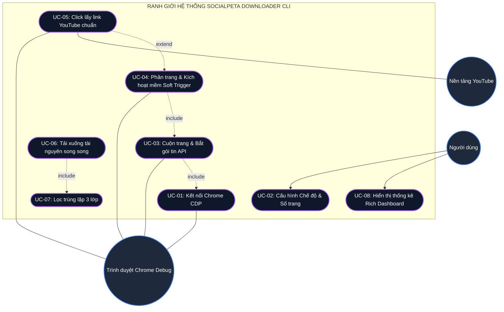
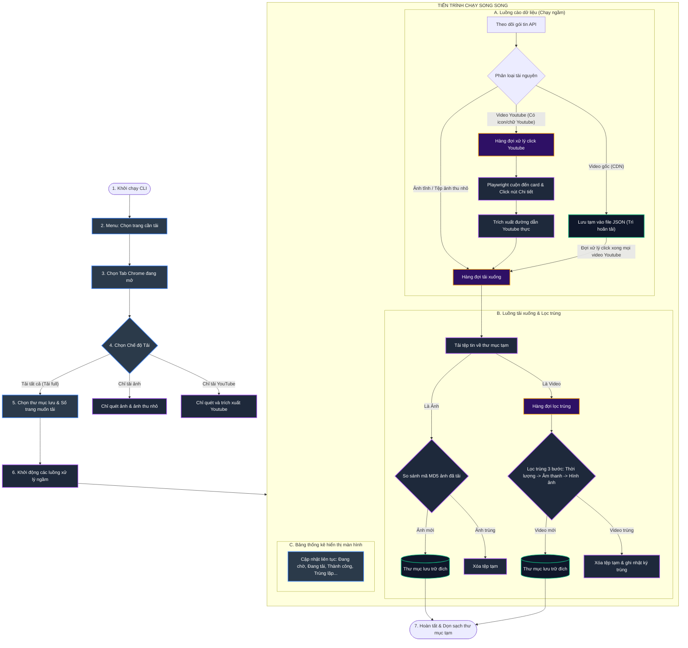
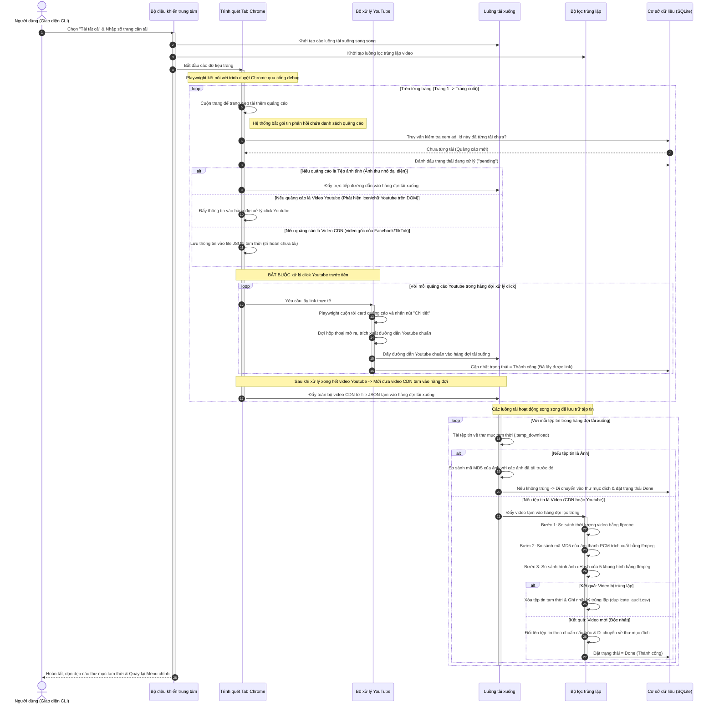

# Tài liệu Đặc tả Sơ đồ Use Case (Use Case Diagram)

Tài liệu này đặc tả các chức năng cốt lõi (Use Cases) của hệ thống **SocialPeta Downloader v2** mà Người dùng (Actor) có thể thực hiện thông qua giao diện CLI.

Để xem sơ đồ dưới dạng hình vẽ trực quan, bạn hãy mở chế độ **Markdown Preview** trong trình soạn thảo (nhấn tổ hợp phím `Ctrl + Shift + V` hoặc click vào biểu tượng Preview ở góc trên cùng bên phải).

---

## 1. Sơ đồ Use Case Đồ họa (Mermaid Diagram)

---

## 2. Đặc tả Chi tiết các Use Case (Use Case Specifications)

### UC-01: Kết nối Chrome CDP (Chrome DevTools Protocol)
- **Tác nhân**: Trình duyệt Chrome Debug.
- **Mô tả**: Hệ thống tự động kiểm tra cổng debug Chrome (mặc định `9222`) và kết nối để lấy danh sách các tab đang hoạt động.
- **Điều kiện tiên quyết**: Chrome phải được mở thủ công bằng lệnh debug `--remote-debugging-port=9222`.
- **Luồng sự kiện chính**:
  1. Hệ thống gửi yêu cầu HTTP GET tới địa chỉ `http://127.0.0.1:9222/json/list`.
  2. Chrome trả về danh sách các tab đang mở.
  3. Hệ thống lọc ra các tab có URL thuộc SocialPeta và hiển thị cho người dùng.
- **Ngoại lệ**: Nếu cổng `9222` không hoạt động, hệ thống sẽ đưa ra thông báo cảnh báo lỗi kết nối và yêu cầu người dùng mở lại Chrome đúng cách.

### UC-02: Cấu hình Chế độ & Số trang
- **Tác nhân**: Người dùng.
- **Mô tả**: Người dùng nhập các thiết lập ban đầu trước khi bắt đầu tải.
- **Luồng sự kiện chính**:
  1. Người dùng chọn tab SocialPeta cần cào.
  2. Người dùng nhập thư mục lưu kết quả.
  3. Người dùng chọn một trong các chế độ: *Chỉ tải ảnh, Chỉ tải Youtube, Tải tất cả (Tải full)*.
  4. Người dùng nhập số lượng trang muốn cào (ví dụ: cào từ trang 1 đến trang 5).
- **Điều kiện sau cùng**: Hệ thống khởi tạo các luồng tải xuống ngầm và luồng lọc trùng lặp dựa trên cấu hình đã chọn.

### UC-03: Cuộn trang & Bắt gói tin API
- **Tác nhân**: Trình duyệt Chrome Debug.
- **Mô tả**: Trình cào quét tự động bắt các gói tin API phản hồi từ SocialPeta chứa thông tin quảng cáo.
- **Luồng sự kiện chính**:
  1. Playwright điều khiển cuộn trang trình duyệt xuống dưới cùng.
  2. Hệ thống đón bắt (sniff) sự kiện `"response"` chứa endpoint `/creative/list` hoặc `/creative-rank/list`.
  3. Phân tích nội dung JSON trả về để bóc tách thông tin (`ad_id`, loại ảnh, video gốc CDN).
  4. Lưu trạng thái các tài nguyên thu thập được vào cơ sở dữ liệu SQLite dưới dạng trạng thái chờ (`pending`).

### UC-04: Phân trang & Kích hoạt mềm (Soft Trigger)
- **Tác nhân**: Trình duyệt Chrome Debug.
- **Mô tả**: Trình cào điều khiển click phím phân trang và kích hoạt nạp lại dữ liệu nếu bị đứng/mất gói tin.
- **Luồng sự kiện chính**:
  1. Playwright tìm nút trang tiếp theo trên giao diện web và click.
  2. Hệ thống đợi gói tin API của trang đó phản hồi.
  3. **Luồng thay thế (Soft Trigger)**: Nếu quá 30 giây không nhận được gói tin, hệ thống tự động thực hiện cuộn trang lên xuống hoặc click vào nút "Tìm kiếm" (Search) để bắt trang web gửi lại gói tin API mới.

### UC-05: Click lấy link YouTube chuẩn
- **Tác nhân**: Trình duyệt Chrome Debug, Nền tảng YouTube.
- **Mô tả**: Click nút "Chi tiết" trên thẻ quảng cáo để mở modal và cào link YouTube gốc.
- **Luồng sự kiện chính**:
  1. Hệ thống tìm kiếm các card quảng cáo có icon/chữ YouTube trên giao diện.
  2. Playwright điều khiển cuộn màn hình đến card đó và click nút **"Chi tiết"** (Detail).
  3. Đợi modal thông tin quảng cáo hiện ra.
  4. Trích xuất thuộc tính `src` của `iframe` YouTube hoặc thuộc tính `href` của đường dẫn YouTube.
  5. Đóng modal quảng cáo (nhấn phím ESC).
  6. Lưu đường dẫn video YouTube thực tế vào SQLite và xếp vào hàng đợi tải xuống.

### UC-06: Tải xuống tài nguyên song song
- **Tác nhân**: Không có (Hệ thống tự động).
- **Mô tả**: Các luồng xử lý tải xuống (Downloader Workers) lấy tài nguyên từ hàng đợi và tải về máy.
- **Luồng sự kiện chính**:
  1. Luồng tải lấy đường dẫn từ hàng đợi.
  2. Đối với ảnh: Tải trực tiếp về thư mục tạm.
  3. Đối với video YouTube: Gọi thư viện `yt-dlp` để tải luồng chất lượng cao nhất về thư mục tạm.
  4. Đối với video CDN gốc: Tải tệp tạm thông qua HTTP client thông thường.

### UC-07: Lọc trùng lặp 3 lớp
- **Tác nhân**: Không có (Hệ thống tự động).
- **Mô tả**: Lọc trùng video trước khi lưu chính thức vào thư mục đích của người dùng.
- **Luồng sự kiện chính**:
  1. **Bước 1 (Thời lượng)**: Kiểm tra chênh lệch thời lượng video bằng `ffprobe`. Nếu chênh lệch quá $0.05$ giây thì xem như không trùng.
  2. **Bước 2 (Âm thanh)**: Trích xuất âm thanh PCM bằng `ffmpeg` và so sánh mã hash MD5 của luồng âm thanh đó.
  3. **Bước 3 (Hình ảnh)**: Trích xuất 5 khung hình tại các thời điểm 10%, 30%, 50%, 70%, 90% thời lượng. So sánh khoảng cách Hamming (dHash) giữa các khung hình (khoảng cách $\le 13$ và chênh lệch độ sáng $\le 10\%$).
  4. **Quyết định**: Nếu trùng, xóa tệp tạm và ghi nhật ký vào `duplicate_audit.csv`. Nếu là duy nhất, lưu tệp vào thư mục đích.

### UC-08: Hiển thị thống kê Rich Dashboard
- **Tác nhân**: Người dùng.
- **Mô tả**: Hiển thị bảng thống kê trực tiếp trên giao diện console/terminal để người dùng theo dõi tiến độ cào tải.
- **Luồng sự kiện chính**:
  1. Màn hình tự động cập nhật liên tục các thông số:
     - Số tab đang hoạt động.
     - Trang hiện tại đang cào.
     - Số lượng ảnh/video đã phát hiện.
     - Đang chờ tải, đang tải, đã hoàn thành.
     - Số video bị trùng lặp đã lọc.

# Sơ đồ hoạt động chi tiết khi nhấn "Tải tất cả" (Tải full)

Để xem sơ đồ dưới dạng hình vẽ trực quan, bạn hãy mở chế độ **Markdown Preview** trong trình soạn thảo (trên VS Code, nhấn tổ hợp phím `Ctrl + Shift + V` hoặc click vào biểu tượng Preview ở góc trên cùng bên phải).

---

## 1. Sơ đồ Luồng Công Việc khi chọn "Tải tất cả" (Dạng lưu đồ)

Sơ đồ này mô tả chi tiết các bước từ lúc bạn bấm phím trên màn hình CLI, chọn chế độ "Tải tất cả" cho đến khi hệ thống tự động phân loại, tải xuống và lọc trùng lặp.

---

## 2. Sơ đồ trình tự tương tác theo thời gian

Sơ đồ trình tự dưới đây thể hiện cách các thành phần trong code tương tác với nhau theo thứ tự trước sau khi bạn chọn **Tải tất cả**:

---

## 3. Cơ chế chống click trùng lặp video YouTube

Để đảm bảo trình duyệt tự động (Playwright) không click lặp lại 2 lần vào cùng một video YouTube, hệ thống kết hợp 2 tầng bảo vệ đồng bộ với cơ sở dữ liệu SQLite:

### Tầng 1: Sử dụng bộ nhớ SQLite (`ad_metadata`) kiểm tra lịch sử tải
- Mỗi quảng cáo được xác định qua một mã định danh duy nhất là `ad_id` từ gói tin API.
- Trước khi đưa bất kỳ video nào vào hàng đợi xử lý click YouTube (`tab_youtube_queues`), hệ thống gọi hàm `_is_ad_already_downloading_or_done(ad_id)`.
- Nếu quảng cáo này đã tồn tại trong lịch sử SQLite với trạng thái đang tải hoặc hoàn thành (`pending`, `downloading`, `done`), hệ thống sẽ **bỏ qua ngay lập tức** mà không xử lý nữa.

### Tầng 2: Thay đổi Loại tài nguyên (Media Type) và Trạng thái sau khi click
Khi Playwright cào xong hoặc xử lý lỗi một card YouTube, loại và trạng thái của nó sẽ được cập nhật vĩnh viễn trong SQLite:
- **Nếu cào thành công**: Loại của quảng cáo đổi từ `video` hoặc `youtube_click_required` sang `youtube_video` (Đã có link YouTube chuẩn).
- **Nếu cào thất bại**: Trạng thái được cập nhật thành `failed`.
- **Nguyên lý loại trừ**: Hàm quét giao diện để phát hiện icon YouTube (`_upgrade_youtube_items_via_dom`) chỉ truy vấn từ DB các tài nguyên có loại là `video` gốc và đang chờ xử lý (`pending`). Do loại tài nguyên và trạng thái đã bị đổi sau khi click, nên trong các lượt cuộn trang tiếp theo hoặc ở các trang khác, quảng cáo này sẽ **bị bỏ qua hoàn toàn** và không bao giờ bị click lại.

---

## 4. Các cơ chế bổ trợ quan trọng khác

Để đảm bảo toàn bộ hệ thống hoạt động ổn định và tin cậy, code còn triển khai các cơ chế phụ trợ sau:

### 4.1. Trích xuất tên Ứng dụng/Nhà quảng cáo linh hoạt (DOM Fallback)
- **Hành vi**: Hệ thống trước tiên cố gắng lấy tên ứng dụng sạch từ tiêu đề của Tab trình duyệt Chrome.
- **Dự phòng (Fallback)**: Nếu tiêu đề không chứa tên ứng dụng hợp lệ (hoặc trả về `UnknownApp`), hệ thống sẽ tự động quét DOM của trang bằng Playwright qua hàm `_scrape_app_name_from_dom` để tìm các phần tử như `.advertiser-name`, `.app-title`, v.v.
- **Kết quả**: Tạo thư mục đích lưu trữ theo định dạng chuẩn: `{Tên_mạng_quảng_cáo}_{Tên_ứng_dụng}_{Ngày_tải}`.

### 4.2. Cơ chế phân trang tự động và Trình kích hoạt mềm (Soft Trigger)
- **Chuyển trang**: Hệ thống tự động click nút chuyển trang trên giao diện SocialPeta từ trang `1` đến trang `N`.
- **Kích hoạt mềm (Soft Trigger)**: Nếu sau khi click chuyển trang mà gói tin API không phản hồi (bị timeout), hàm `soft_trigger` sẽ được kích hoạt để cuộn trang lên xuống liên tục hoặc tự động click vào nút "Tìm kiếm" (Search) trên giao diện để kích thích trang web gửi lại gói tin API mới mà không gây treo luồng.

### 4.3. Dọn dẹp tệp tin tạm thời khi hoàn tất
- Trong suốt quá trình cào, các tệp tin được lưu trong thư mục tạm `.temp_download`.
- Khi tất cả hàng đợi đã xử lý xong và được lọc trùng thành công vào thư mục đích, toàn bộ các tệp tin tạm này sẽ được dọn dẹp sạch sẽ để tránh làm đầy dung lượng ổ đĩa của bạn.

