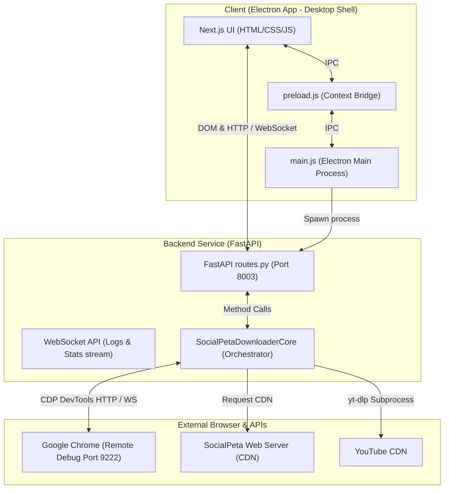
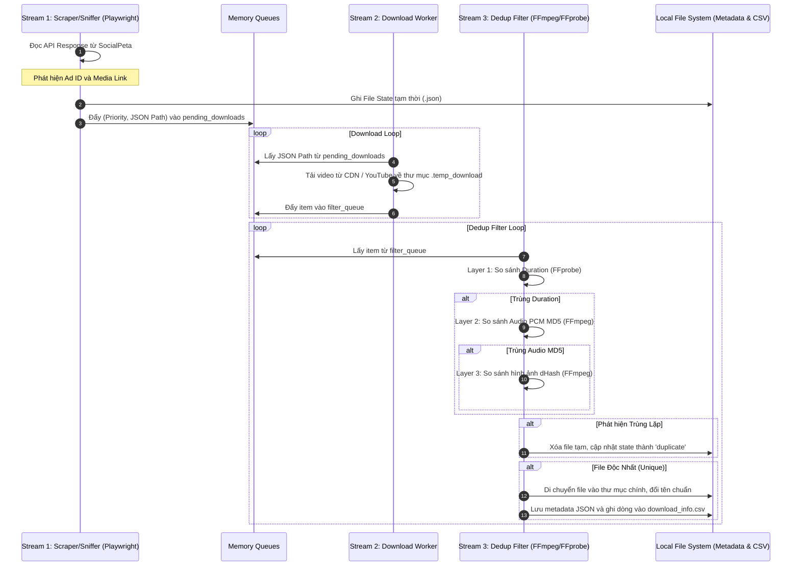
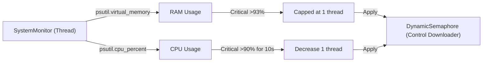
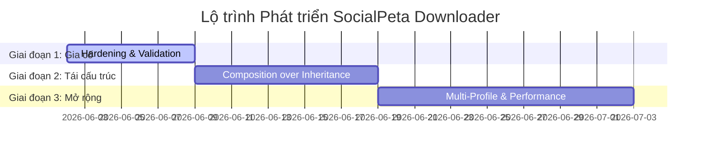

# TÀI LIỆU KIỂM TRA SỨC KHỎE KỸ THUẬT VÀ LỘ TRÌNH PHÁT TRIỂN
## PROJECT: SOCIALPETA DOWNLOADER (ELECTRON - NEXT.JS - FASTAPI)

> [!NOTE]
> Tài liệu này được biên soạn bởi **Antigravity AI (Senior Technical Consultant)** nhằm đánh giá toàn diện sức khỏe kỹ thuật hiện tại của dự án SocialPeta Downloader, xác định các điểm nợ kỹ thuật (Technical Debt) và thiết lập một lộ trình hành động (Action Roadmap) để chuẩn bị cho các giai đoạn nâng cấp, mở rộng hiệu năng cao.

---

## 1. BẢN ĐỒ KIẾN TRÚC VÀ LUỒNG DỮ LIỆU (TECHNICAL MAP)

Ứng dụng được thiết kế theo mô hình **Desktop Hybrid (Lai)** với 3 tầng chính:
1. **Frontend**: Next.js (chạy static export trong Electron).
2. **Desktop Shell**: Electron Wrapper (quản lý cửa sổ hệ điều hành và IPC giao tiếp).
3. **Backend API**: Python FastAPI (chạy dưới dạng Compiled Binary `api.exe` được đóng gói bằng PyInstaller, tích hợp FFmpeg/FFprobe và yt-dlp).

### 1.1. Sơ đồ Kiến trúc Tổng thể (Overall Architecture)

---

### 1.2. Sơ đồ Luồng Dữ liệu Scraper & Download (3-Stream Pipeline)

Ứng dụng vận hành một mô hình 3 luồng xử lý song song để tối đa hóa băng thông và tránh chặn UI (Non-blocking):
- **Stream 1 (Scraping/Sniffing)**: Chạy trên Playwright CDP để bắt các gói tin API Response chứa metadata, đồng thời click trích xuất link YouTube.
- **Stream 2 (Downloading)**: Đọc từ hàng đợi ưu tiên `pending_downloads` để tải file về thư mục `.temp_download`.
- **Stream 3 (Deduplication Filter)**: Đọc từ `filter_queue` để thực hiện kiểm tra trùng lặp 3 tầng trước khi lưu chính thức.

---

### 1.3. Luồng Giám sát Tài nguyên & Điều tiết Luồng (System Monitor & Control)

---

## 2. ĐÁNH GIÁ TIÊU CHUẨN KỸ THUẬT (TECHNICAL AUDIT)

Chúng tôi đã tiến hành đánh giá chi tiết cấu trúc code hiện tại và đối chiếu với các Best Practices cấp Senior:

### 2.1. Cấu trúc thư mục & Tách biệt Layer
*   **Điểm tốt (Pros)**:
    - Dự án đã hoàn thành tái cấu trúc theo mô hình **Tool-based Workspace**. Toàn bộ mã nguồn backend Python được đặt gọn trong thư mục `tools/socialpeta_downloader/`, phân tách rõ ràng với frontend Next.js (`frontends/socialpeta_downloader/`) và cấu trúc Electron (`electron/`).
    - Cấu trúc module backend được chia nhỏ thành các mixin riêng biệt (`chrome.py`, `deduplication.py`, `downloader.py`, `tab_manager.py`, `session.py`, `youtube.py`) giúp phân tách trách nhiệm tương đối tốt.
*   **Điểm cần cải thiện (Cons)**:
    - Việc sử dụng kế thừa đa lớp (Multiple Inheritance Mixins) cho `SocialPetaDownloaderCore` tạo ra sự phụ thuộc chéo ngầm. Các mixin gọi phương thức của nhau thông qua `self` mà không có định nghĩa Interface tường minh, gây khó khăn cho việc phân tích tĩnh (Static Analysis) và phát sinh nhiều stub `if TYPE_CHECKING` để tránh cảnh báo từ Pylance.

### 2.2. Xử lý lỗi (Error Handling) và Ghi nhật ký (Logging)
*   **Điểm tốt (Pros)**:
    - Bọc `SafeStreamWrapper` quanh `sys.stdout` và `sys.stderr` giúp ngăn chặn triệt để lỗi crash `UnicodeEncodeError` (EPIPE / ascii codec) khi ứng dụng được biên dịch và chạy trên nền Windows Console không hỗ trợ UTF-8.
    - Hệ thống Logging sử dụng mô hình **Publisher-Subscriber (Pub-Sub)** với `log_queue` giúp truyền log theo thời gian thực (Real-time Streaming) qua kết nối WebSocket trực tiếp đến UI Next.js rất mượt mà.
    - Khôi phục phiên làm việc (`restore_session`) khi khởi động lại ứng dụng giúp xử lý tốt các tệp tin tải dở dang (`downloading` -> `pending`, `downloaded` -> `filter`).
*   **Điểm cần cải thiện (Cons)**:
    - Nhiều khối lệnh `try...except` sử dụng `except Exception: pass` trống hoặc chỉ print mà không lưu lại Stack trace đầy đủ, có thể che giấu các lỗi hệ thống nghiêm trọng (ví dụ như phân rã JSON hỏng hoặc lỗi phân quyền tệp tin).

### 2.3. Bảo mật (Security)
*   **Điểm tốt (Pros)**:
    - Đã có cơ chế kiểm tra `is_safe_url` dựa trên `urllib.parse` để bảo vệ ứng dụng khỏi các lỗ hổng **SSRF (Server-Side Request Forgery)** khi Playwright được lệnh điều hướng (`page.goto`).
*   **Điểm cần cải thiện (Cons)**:
    - Endpoint API `/config` nhận tham số `download_dir` và gọi `os.makedirs` có thực hiện ghi tệp tin thử nghiệm `.write_test`. Tuy nhiên, chưa kiểm tra ký tự độc hại trong đường dẫn (như Path Traversal hoặc Path Injection), mặc dù đã bị giới hạn độ dài 150 ký tự.

### 2.4. Quản lý cấu hình (Configuration Management)
*   **Điểm tốt (Pros)**:
    - Giải quyết động đường dẫn thư mục gốc (`ROOT_DIR`) dựa trên trạng thái biên dịch (`sys.frozen`), cho phép ứng dụng chạy portable độc lập mà không bị dính cứng đường dẫn phát triển (hardcoded dev paths).
*   **Điểm cần cải thiện (Cons)**:
    - Các giá trị cổng mặc định như `8003` (API Port), `9222` (Chrome CDP Port), `3000` (Frontend Dev Port) đang được hardcode rải rác hoặc đọc trực tiếp từ `os.getenv` với giá trị dự phòng mặc định cứng.

---

## 3. DANH SÁCH NỢ KỸ THUẬT (TECHNICAL DEBT)

> [!WARNING]
> Dưới đây là các khoản nợ kỹ thuật cần được giải quyết để tăng độ ổn định của ứng dụng khi chạy trên môi trường Production thực tế của khách hàng:

| Mã Nợ | Thành phần | Mô tả chi tiết | Mức độ | Hậu quả tiềm ẩn |
| :--- | :--- | :--- | :--- | :--- |
| **TD-01** | `downloader.py` | Đường dẫn `yt-dlp` đang được kiểm tra tồn tại thông qua các chuỗi hardcode tương đối (`.venv/Scripts/yt-dlp.exe`, v.v.). | **Trung bình** | Nếu người dùng cài ứng dụng ở thư mục không chuẩn hoặc chạy portable không kèm venv, yt-dlp sẽ không tìm thấy. |
| **TD-02** | `deduplication.py` | Kiểm tra sự tồn tại của `ffmpeg` và `ffprobe` chỉ bằng cách chạy thử `--version` lúc khởi động thread. Chưa có kiểm tra tại thời điểm bắt đầu gọi trích xuất frame. | **Thấp** | Ứng dụng chạy ngầm nhưng bộ lọc trùng lặp video sẽ bị treo hoặc bỏ qua mà không báo lỗi rõ ràng lên UI nếu binaries bị hỏng giữa chừng. |
| **TD-03** | `routes.py` | Thiếu timeout chuẩn cho các request HTTP gọi đến Chrome CDP `/json/list` hoặc `/json/version` trong một số trường hợp, dễ gây nghẽn luồng FastAPI nếu Chrome bị đơ (hang). | **Trung bình** | API FastAPI bị block, khiến UI không phản hồi (Not Responding) và mất kết nối WebSocket. |
| **TD-04** | `tab_manager.py` | Cách thức trích xuất `app_name` từ Title của trang web dựa vào Regex phân tách `-`, `_`, `•` rất dễ bị sai lệch nếu SocialPeta thay đổi cấu trúc hiển thị Title của họ. | **Thấp** | Tên thư mục tải về và tên tệp tin lưu trữ bị đặt sai thành `UnknownApp`. |
| **TD-05** | `chrome.py` | Custom Chrome Profile được lưu trong thư mục `data/chrome_debug_profile` ngay tại thư mục root của dự án. | **Thấp** | Khi chạy ở chế độ compiled (`sys.frozen`), thư mục gốc có thể nằm trong `Program Files` - nơi yêu cầu quyền Admin để ghi dữ liệu, gây lỗi Chrome không khởi chạy được. |
| **TD-06** | `Core Mixins` | Cấu trúc đa kế thừa Mixin không có Type Safety khiến IDE liên tục cảnh báo lỗi Type Check, làm mờ đi các lỗi logic thực sự khác trong quá trình code. | **Trung bình** | Khó bảo trì, khó viết Unit Test độc lập cho từng module. |

---

## 4. LỘ TRÌNH HÀNH ĐỘNG (TECHNICAL ROADMAP)

Lộ trình này được thiết kế theo 3 giai đoạn cuốn chiếu nhằm đảm bảo hệ thống luôn hoạt động ổn định ở mỗi bước thay đổi (Surgical & Goal-oriented).

### GIAI ĐOẠN 1: GIA CỐ HỆ THỐNG & VALIDATION (THỰC HIỆN NGAY)
*   **Mục tiêu**: Giải quyết triệt để các lỗi tiềm ẩn về đường dẫn, quyền ghi đĩa và timeout kết nối.
*   **Các bước hành động**:
    1.  **Hardening Path Resolution**:
        - Thay đổi vị trí lưu trữ `chrome_debug_profile` và `config.json` sang thư mục AppData của người dùng (`USER_DATA_PATH` hoặc `app.getPath('userData')` được truyền động từ Electron) thay vì lưu tại thư mục cài đặt ứng dụng.
    2.  **Binary Path Verification**:
        - Viết hàm kiểm tra và cấu hình động đường dẫn tới `ffmpeg`, `ffprobe` và `yt-dlp` ngay khi ứng dụng khởi chạy. Nếu thiếu, hiển thị thông báo lỗi trực quan trên UI thay vì ghi âm thầm vào log file.
    3.  **Strict Timeouts**:
        - Thêm tham số `timeout=2.0` cho tất cả các cuộc gọi HTTP cục bộ đến Chrome CDP để phòng ngừa tắc nghẽn luồng API.

---

### GIAI ĐOẠN 2: TÁI CẤU TRÚC KIẾN TRÚC CORE (REFACTORING)
*   **Mục tiêu**: Loại bỏ sự phụ thuộc chéo của Mixin, nâng cao độ tin cậy của mã nguồn và hỗ trợ viết Unit Test.
*   **Các bước hành động**:
    1.  **Chuyển đổi sang Composition (Ủy thác)**:
        - Tách `SocialPetaDownloaderCore` thành một lớp điều phối trung tâm nắm giữ các thực thể dịch vụ (Services) như `ChromeService`, `DeduplicationService`, `DownloadManager`, `TabScanner`.
        - Giao tiếp giữa các Service qua Interface/Abstract Class được định nghĩa rõ ràng.
    2.  **Unit Testing Framework**:
        - Thiết lập thư viện `pytest` để kiểm tra độc lập:
            - Thuật toán trích xuất `app_name` từ tiêu đề.
            - Thuật toán so khớp dHash và Audio PCM MD5 (sử dụng mock video).
            - Các bộ lọc bảo mật URL SSRF.

---

### GIAI ĐOẠN 3: TỐI ƯU HIỆU NĂNG & MỞ RỘNG TÍNH NĂNG (SCALING)
*   **Mục tiêu**: Tăng tốc độ tải hàng loạt và cải thiện trải nghiệm người dùng.
*   **Các bước hành động**:
    1.  **Multi-Profile/Multi-Instance Support**:
        - Cho phép người dùng chạy nhiều luồng quét trên các tài khoản SocialPeta khác nhau thông qua việc quản lý các cổng Chrome debug động (ví dụ: `9222`, `9223`, `9224`).
    2.  **Persistent Database (SQLite)**:
        - Thay thế việc ghi dữ liệu vào tệp tin CSV và JSON flat files bằng cơ sở dữ liệu SQLite cục bộ được bảo vệ bởi một thread-safe connection pool. Điều này giúp tối ưu hóa việc truy vấn, xuất báo cáo và loại bỏ hoàn toàn các lỗi lock file khi đọc/ghi đồng thời.
    3.  **Hỗ trợ mạng quảng cáo mới**:
        - Dựa trên kiến trúc Service mới ở Giai đoạn 2, dễ dàng phát triển thêm các module Scraper cho các nền t hạn quảng cáo khác ngoài SocialPeta (như AdSpy, BigSpy) mà không làm ảnh hưởng đến lõi tải và lọc trùng lặp của ứng dụng.

---

> [!TIP]
> **Kết luận**: Hệ thống hiện tại của SocialPeta Downloader có độ hoàn thiện kỹ thuật rất cao, cấu trúc xử lý bất đồng bộ kết hợp đa luồng và cơ chế điều tiết tài nguyên tự động rất thông minh. Việc giải quyết các khoản nợ kỹ thuật ở Giai đoạn 1 sẽ biến ứng dụng thành một sản phẩm thương mại cực kỳ mạnh mẽ và ổn định.
